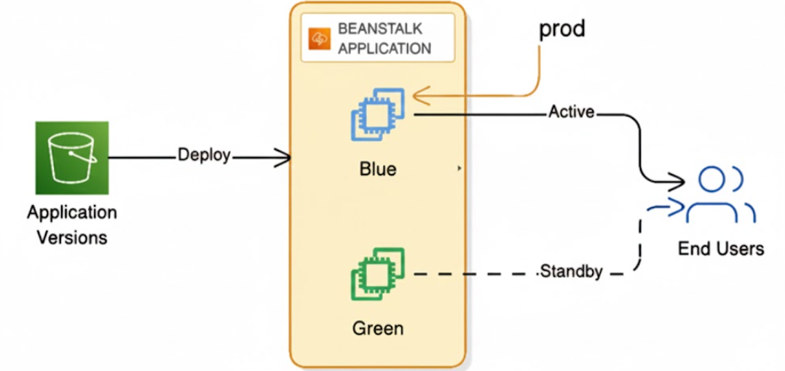

# Day 17: AWS Elastic Beanstalk Blue–Green Deployment – Zero-Downtime Deployments with Terraform | #30DaysOfAWSTerraform


In modern software delivery, deployment reliability is just as important as writing clean code. Traditional deployment methods often lead to downtime, service interruptions, and stressful rollbacks that impact both users and teams. Blue-Green Deployment changes that narrative. It’s a proven strategy that enables seamless version releases with **zero downtime**, **safe testing**, and **instant rollback** if something goes wrong. In this post, I’ll demonstrate how to implement Blue-Green Deployment using **AWS Elastic Beanstalk** and **Terraform.**

## **What is Blue-Green Deployment?**

Blue-Green Deployment is a software release strategy that minimizes risk and downtime during application updates by using **two identical production environments** .

At any given time, one environment, typically called **"Blue,"** is the **live** environment, serving all user traffic. The other identical environment, **"Green,"** is used to stage and test the new version of the application.

### 🔵 **Blue Environment**

-   Current **production**
    
-   Running the stable version (v1.0)
    

### 🟢 **Green Environment**

-   Staging environment
    
-   Runs the **new version** (v2.0)
    

Once the green version is fully tested and validated, **traffic is swapped instantly**, making the green environment the new production—without any downtime.

## **Swap Process**

In a Blue-Green Deployment, particularly within AWS Elastic Beanstalk, is the critical, low-downtime mechanism used to direct production traffic from the old version of an application (Blue) to the new version (Green).

Initial State (Blue is Live)

-   The user's domain (e.g., [`www.myapp.com`](http://www.myapp.com/)) is pointing via DNS (e.g., AWS Route 53) to the public URL of the **Blue** environment (e.g., [`blue-env.elasticbeanstalk.com`](http://blue-env.elasticbeanstalk.com/)).
    
-   The **Green** environment (e.g., [`green-env.elasticbeanstalk.com`](http://green-env.elasticbeanstalk.com/)) is running the new, tested code but is only accessible via its temporary internal URL.
    

The Swap Operation

-   When you execute the "Swap Environment URLs" action (via the AWS Console, CLI `eb swap`, or Terraform), Elastic Beanstalk updates its internal DNS mapping.
    
-   It **swaps the CNAMEs** registered for the two environments.
    

Resulting State (Green is Live):

-   The public URL that was previously pointing to Blue ([`blue-env.elasticbeanstalk.com`](http://blue-env.elasticbeanstalk.com/)) is now remapped to point to the Load Balancer of the **Green** environment.
    
-   The public URL that was previously pointing to Green ([`green-env.elasticbeanstalk.com`](http://green-env.elasticbeanstalk.com/)) is now remapped to point to the Load Balancer of the **Blue** environment.
    

## Key Benefits of Blue-Green Deployment

1.  Zero Downtime: Application stays online even during major version upgrades.
    
2.  Instant Rollback : If something breaks, swap traffic back to the blue environment.
    
3.  Production-Level Testing : Green environment mirrors production exactly—same infrastructure, configurations, autoscaling, and health checks.
    
4.  Risk-Free Deployments : New changes are validated safely before they ever reach users.
    

## Terraform in Action: Automating Your Blue-Green Infrastructure



For this challenge, Terraform was used to provision and manage all AWS resources required for the Blue-Green deployment. By defining everything as code, the entire environment becomes repeatable, consistent, and easy to maintain.

### Preparing Application Bundles for Deployment

To prepare both application versions for deployment, I used a simple packaging script. This script bundles each application into a `.zip` file **app-v1.zip** for the Blue environment and **app-v2.zip** for the Green environment. These zipped artifacts are then uploaded to an S3 bucket, where Terraform can reference them directly when creating the Elastic Beanstalk application versions.

Elastic Beanstalk requires application bundles to be stored in S3 before they can be deployed, so this script plays an essential role in the workflow. It ensures both versions are packaged consistently, named correctly, and ready for Terraform to pick up and deploy into their respective environments.

```
chmod +x package_apps.sh  
.\package-apps.sh
```

## How Elastic Beanstalk Launches Resources

Before creating the Elastic Beanstalk environments, the very first thing we must define in Terraform is the **IAM layer**. This is because Elastic Beanstalk relies on two different permission models, and both must exist _before_ AWS can provision any of the dependent infrastructure (EC2, ALB, Auto Scaling Group, etc.).

To keep our deployment predictable, secure, and fully Infrastructure-as-Code, we explicitly create these IAM roles as Terraform resources.

Elastic Beanstalk is unique because it needs **two separate IAM roles**, each operating at a different layer.

1.  Elastic Beanstalk Service Role — “The Manager”

This role allows Elastic Beanstalk to manage AWS infrastructure on your behalf. Without this role, Beanstalk cannot:

-   Launch EC2 instances
    
-   Create and manage Auto Scaling Groups
    
-   Configure CloudWatch metrics and alarms
    
-   Create Load Balancers
    
-   Manage capacity and health checks
    

Terraform requires explicit definitions. By defining the service role ourselves, we ensure:

-   Permissions follow least privilege
    
-   Infrastructure is portable across accounts/regions
    
-   Nothing is implicitly created by AWS (which breaks IaC principles)
    

2.  EC2 Instance Profile — “The Worker”
    
    The **EC2 instances** running your application. This role grants permission to the internal Elastic Beanstalk agent and your application code. Without it, the instance cannot:
    
    -   Download application bundles from S3
        
    -   Push logs to CloudWatch
        
    -   Access AWS services the app may rely on (Secrets Manager, SQS, RDS, etc.)
        

AWS cannot guess what app needs. Defining the instance profile ensures:

-   Only the required permissions are granted
    
-   You can add custom permissions depending on the app
    
-   The environment works consistently across all deployments
    

### Creating Roles and Attaching Policies

1.  EC2 Instance Profile (The Application Role)

This is the role the actual EC2 instances will assume. It grants permissions for the application and the Beanstalk agent to read code from S3, write logs to CloudWatch, etc.

```
# IAM Role for Elastic Beanstalk EC2 instances
resource "aws_iam_role" "eb_ec2_role" {
  name = "${var.app_name}-eb-ec2-role"
# Trust Policy: Allows the EC2 Service to assume this role
  assume_role_policy = jsonencode({
    Version = "2012-10-17"
    Statement = [
      {
        Action = "sts:AssumeRole"
        Effect = "Allow"
        Principal = {
          Service = "ec2.amazonaws.com"
        }
      }
    ]
  })

  tags = var.tags
}

# Attach required AWS Managed Policies
resource "aws_iam_role_policy_attachment" "eb_web_tier" {
  role       = aws_iam_role.eb_ec2_role.name
  policy_arn = "arn:aws:iam::aws:policy/AWSElasticBeanstalkWebTier"
}

# Attach the AWS managed policy for Worker Tier
resource "aws_iam_role_policy_attachment" "eb_worker_tier" {
  role       = aws_iam_role.eb_ec2_role.name
  policy_arn = "arn:aws:iam::aws:policy/AWSElasticBeanstalkWorkerTier"
}

# Attach the AWS managed policy for Multicontainer Docker
resource "aws_iam_role_policy_attachment" "eb_multicontainer_docker" {
  role       = aws_iam_role.eb_ec2_role.name
  policy_arn = "arn:aws:iam::aws:policy/AWSElasticBeanstalkMulticontainerDocker"
}
```

2.  Elastic Beanstalk Service Role (The Management Role)
    
    This role gives the Elastic Beanstalk service permission to manage resources like the Load Balancer, Auto Scaling Group, and Security Groups on your behalf.
    
    ```
     # IAM Role for Elastic Beanstalk Service
     resource "aws_iam_role" "eb_service_role" {
       name = "${var.app_name}-eb-service-role"
     # Trust Policy: Allows the Elastic Beanstalk Service to assume this role
       assume_role_policy = jsonencode({
         Version = "2012-10-17"
         Statement = [
           {
             Action = "sts:AssumeRole"
             Effect = "Allow"
             Principal = {
               Service = "elasticbeanstalk.amazonaws.com"
             }
           }
         ]
       })
    
       tags = var.tags
     }
    
     # Attach Enhanced Health Reporting policy
     resource "aws_iam_role_policy_attachment" "eb_service_health" {
       role       = aws_iam_role.eb_service_role.name
       policy_arn = "arn:aws:iam::aws:policy/service-role/AWSElasticBeanstalkEnhancedHealth"
     }
    
     # Attach Managed Updates policy
     resource "aws_iam_role_policy_attachment" "eb_service_managed_updates" {
       role       = aws_iam_role.eb_service_role.name
       policy_arn = "arn:aws:iam::aws:policy/AWSElasticBeanstalkManagedUpdatesCustomerRolePolicy"
     }
    ```
    

### IAM Instance Profile Creation

An IAM Instance Profile is basically a delivery mechanism that attaches an IAM Role to an EC2 instance. EC2 cannot use an IAM Role directly, so AWS uses an Instance Profile as the bridge.

When the instance launches, AWS automatically gives it temporary security credentials based on the permissions defined in the role. This lets your application safely access AWS services (like S3, CloudWatch, DynamoDB) without storing any access keys in the code or on the server.

```
#IAM Instance Profile (The container to deliver the role to EC2)
resource "aws_iam_instance_profile" "eb_ec2_profile" {
  name = "${var.app_name}-eb-ec2-profile"
  role = aws_iam_role.eb_ec2_role.name
  tags = var.tags
}
```

The **role** (`eb_ec2_role`) contains the permissions the application needs (e.g., download app code from S3, upload logs, access other AWS resources). The **Instance Profile** (`eb_ec2_profile`) is what Elastic Beanstalk attaches to each EC2 instance.

## Create S3 Bucket

The primary purpose of creating an S3 bucket to hold application code, and its connection to AWS Elastic Beanstalk, is to establish a secure**,** centralized storage repository for application versions.

The S3 bucket is where upload the `.zip` file containing application code. Each unique file upload represents a specific, versioned release of the application. By using a bucket and applying the `aws_s3_bucket_public_access_block`, ensure that your proprietary source code is kept **private** and secure, accessible only to authorized services within AWS account.

```
# S3 Bucket for application versions
resource "aws_s3_bucket" "app_versions" {
  bucket = "${var.app_name}-versions-${data.aws_caller_identity.current.account_id}"
  tags = var.tags
}

# Block public access to S3 bucket
resource "aws_s3_bucket_public_access_block" "app_versions" {
  bucket = aws_s3_bucket.app_versions.id
  block_public_acls       = true
  block_public_policy     = true
  ignore_public_acls      = true
  restrict_public_buckets = true
}
```

## Setup Elastic Beanstalk Environment

### The Application Container

This is the parent resource that holds both the Blue and Green environments, grouping them under a single application name.

```
# Elastic Beanstalk Application
resource "aws_elastic_beanstalk_application" "app" {
  name        = var.app_name
  description = "Blue-Green Deployment Demo Application"
  tags = var.tags
}
```

The core strength of a Blue-Green strategy lies in maintaining two identical environments that exist in parallel. Think of them as two separate stages: one is currently performing for the audience, while the other is being set up behind the curtain for the next act.

Before looking at the environments, both versions share core infrastructure settings to ensure parity

-   **Platform:** Both utilize the latest **Node.js 20** solution stack on Amazon Linux 2023.
    
-   **Security:** Both use a standard **IAM Instance Profile** (`eb_ec2_profile`) and a **Service Role** (`eb_service_role`) for AWS permissions.
    
-   **Infrastructure:** Both are configured as **Load Balanced** using an **Application Load Balancer**.
    
-   **Scaling:** To handle traffic, both have an **Auto Scaling Group** with a minimum of **1** and a maximum of **2** instances.
    
-   **Network:** Both listen on **Port 8080** via **HTTP** and perform health checks at the root path (`/`).
    

**Versioning Your Application:**

The deployment starts by uploading code to an **S3 bucket** and registering it with Elastic Beanstalk.

-   **Version 1.0 (Blue):** This is the initial release stored as [`app-v1.zip`](http://app-v1.zip/) in S3. It is registered as a unique application version label `${`[`var.app`](http://var.app/)`_name}-v1`.
    
-   **Version 2.0 (Green):** This represents the new release, stored as [`app-v2.zip`](http://app-v2.zip/). It is registered under the label `${`[`var.app`](http://var.app/)`_name}-v2`
    

**The Blue Environment (Live)**

The **Blue** environment is current source of truth. It hosts the stable version of your application (v1.0) that customers are interacting with right now.

```
# Blue Environment (The Current Live Version)
resource "aws_elastic_beanstalk_environment" "blue" {
  name                = "${var.app_name}-blue"
  application         = aws_elastic_beanstalk_application.app.name
  solution_stack_name = data.aws_elastic_beanstalk_solution_stack.latest_nodejs20_al2023.name
  tier                = "WebServer"
  version_label       = aws_elastic_beanstalk_application_version.v1.name

  # Environment Type (Load Balanced)
  setting {
    namespace = "aws:elasticbeanstalk:environment"
    name      = "EnvironmentType"
    value     = "LoadBalanced"
  }

  # ... (other settings)
}
```

-   Version**:** It runs Version 1.0.
    
-   Role**:** It is explicitly tagged with `Role = "production"` and `Environment = "blue"`.
    
-   Variables**:** It injects internal environment variables set to `VERSION = "1.0"` and `ENVIRONMENT = "blue"`
    
-   Update Policy**:** It uses a Rolling deployment policy with a 50% batch size to ensure even internal updates are safe.
    

**The Green Environment (Next-Gen)**

The **Green** environment is an exact clone of Blue, but it carries your new updates (v2.0). It lives in a "dark" state meaning it is fully functional and connected to your databases, but it is not yet reachable by your public URL. This allows for final smoke tests in a real-world environment without risking the user experience.

```
# Green Environment (The Next Release)
resource "aws_elastic_beanstalk_environment" "green" {
  name                = "${var.app_name}-green"
  application         = aws_elastic_beanstalk_application.app.name
  solution_stack_name = data.aws_elastic_beanstalk_solution_stack.latest_nodejs20_al2023.name
  tier                = "WebServer"
  version_label       = aws_elastic_beanstalk_application_version.v2.name

  setting {
    namespace = "aws:elasticbeanstalk:application:environment"
    name      = "ENVIRONMENT"
    value     = "green"
  }
# ... (other settings)
}
```

-   Version**:** It runs the newly uploaded Version 2.0.
    
-   Role**:** It is tagged as `Role = "staging"` and `Environment = "green"`.
    
-   Variables**:** The application-level variables reflect the new state: `VERSION = "2.0"` and `ENVIRONMENT = "green"`.
    
-   Parity**:** By using the same Rolling deployment and Scaling settings as Blue, you can be confident that performance in Green matches what will happen in Production.
    
    **Key Settings:**
    

When writing config, these four sections are critical for a stable production environment:

1.  IAM & Permissions**:** We use `IamInstanceProfile` and `ServiceRole` to give AWS the keys to manage logs, S3 buckets, and scaling groups automatically.
    
2.  Auto Scaling**:** By setting `MinSize` to 1 and `MaxSize` to 2, we ensure high availability. If one server crashes, AWS instantly replaces it.
    
3.  The Load Balancer**:** We use an Application Load Balancer (ALB). This is the "brain" that routes traffic and allows for the seamless swap between environments.
    
4.  Health Checks**:** The `HealthCheckPath` is set to `/`. This acts as a pulse-check for your app; if it doesn't return a "200 OK," the load balancer stops sending traffic there.
    

### **Deployment**

The infrastructure was deployed with the standard Terraform workflow:

```
terraform init
terraform plan
terraform apply
```

Once the deployment was complete, Navigate to the AWS Console every Elastic Beanstalk environment has a unique URL like :

click the doman and verify

-   **Blue URL (Production):** Showed **"Welcome to blue-green demo v1.0"**
    
-   **Green URL (Staging):** Showed **"New features in v2.0"**
    

## **The Zero-Downtime Swap**

The most critical moment of a Blue-Green deployment is the **Traffic Swap**. This is where your preparation pays off, transitioning your users from the old version to the new one with zero friction. In an AWS Elastic Beanstalk environment, "deploying" doesn't mean moving code or restarting servers in the traditional sense. Instead, AWS simply swaps the **DNS records (CNAMEs)** that point to the load balancer of each environment.

Because both **Blue** and **Green** environments are already up, running, and verified as healthy, the transition is instantaneous and seamless for your end-users.

The core of this entire strategy is executed through a single, powerful AWS CLI command:

```
# Execute the swap to go live with version 2.0
aws elasticbeanstalk swap-environment-cnames \
  --source-environment-name "my-app-bluegreen-blue" \
  --destination-environment-name "my-app-bluegreen-green"
```

The true beauty of the Blue-Green swap isn't just how you go forward—it's how easily you can go back. If version 2.0 reveals a critical bug under real production load, you don't need to panic or start a long restoration process.

To perform a **Rollback**, you simply reverse the command:

```
# Oops, v2 has issues! Swap back to the stable version 1.0
aws elasticbeanstalk swap-environment-cnames \
  --source-environment-name "my-app-bluegreen-green" \
  --destination-environment-name "my-app-bluegreen-blue"
```

Back to the stable version (v1.0) in **seconds, not hours**. This "undo button" is what allows modern DevOps teams to deploy with high frequency and zero fear.

## When Should You Use Blue-Green Deployment

-   High Reliability for Production Apps: Critical workloads that cannot tolerate downtime
    
-   Instant Rollback Requirements : Teams that want quick fallback without redeployments.
    
-   Safe Testing Before Release : Test new versions in a production-identical setup.
    
-   Zero Downtime Deployments**:** User-facing services, APIs, e-commerce systems, portals, etc.
    

## Conclusion

Blue-green deployment is a powerful and essential technique for any team aiming for smooth, safe, and zero-downtime releases. With Terraform + AWS Elastic Beanstalk, you can automate the entire process—from provisioning environments to swapping traffic—in just minutes.

## Reference

https://www.youtube.com/watch?v=fTVx2m5fEbQ&list=PLl4APkPHzsUXcfBSJDExYR-a4fQiZGmMp&index=21
