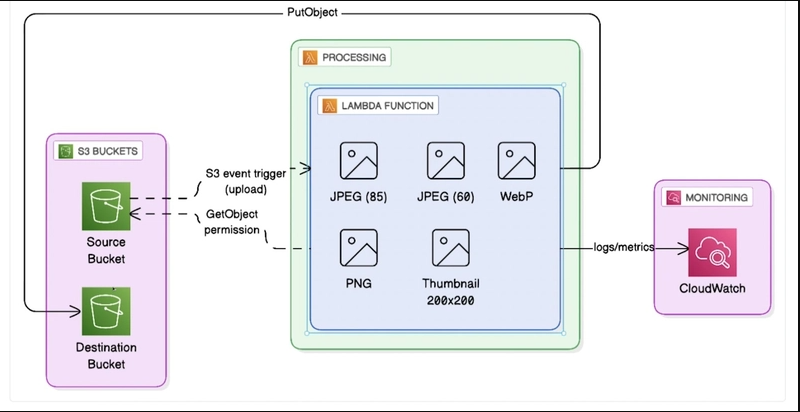

# Day 18 : Build a Serverless Image Processing Project Using Terraform and AWS Lambda | #30DaysOfAWSTerraform

In this blog we explore how to build a **serverless image processing application using AWS Lambda and Terraform**, enabling you to process images automatically when they are uploaded — all without provisioning or managing servers.

Before diving into the project, it’s important to clearly understand **what AWS Lambda is, why it’s powerful, and how it fits into a serverless architecture**. Once that foundation is set, we’ll explore how Terraform helps us automate the entire setup.

## Traditional Server-Based Approach

Before serverless services like AWS Lambda, applications were built using a **traditional server-based model**. In a traditional architecture, developers are responsible for **managing servers**—either on-premises or in the cloud using virtual machines like EC2.

### Challenges with Traditional Servers

1.  Server Management Overhead: You must manage OS updates and patches, security hardening, software installations and server failures and recovery
    
2.  Manual or Complex Scaling
    
3.  Higher Costs
    
4.  Operational Risk: Human errors during configuration
    
5.  Slower Development : Developers spend time on infrastructure instead of focusing on Business logic, Feature development, Innovation
    

Serverless architecture powered by **AWS Lambda** removes these limitations by shifting infrastructure responsibility to AWS.

## What is AWS Lambda?

**AWS Lambda** is a serverless compute service that lets you run code **without provisioning or managing servers**. You simply upload your code, define a trigger, and AWS takes care of the rest — including scaling, availability, and maintenance.

With Lambda, you only pay for:

-   Number of requests
    
-   Execution duration
    

There is **no cost when your code isn’t running**, making it highly cost-efficient. When we say _serverless_, it doesn’t mean servers no longer exist. The servers are still there — but AWS manages them for us.

As developers, we **don’t worry about**:

-   Operating systems
    
-   Server patching and maintenance
    
-   Scaling infrastructure
    
-   High availability and uptime
    

Our responsibility **ends with writing and deploying the code**. Everything else is handled by AWS.

A Lambda function does NOT run all the time. Unlike traditional servers that are always running and consuming resources, a Lambda function runs **only when it is needed**.

### What Triggers a Lambda Function?

A Lambda function is executed when an **event** occurs. An **event** is simply something that happens in your system that requires a response.

Common Lambda Events Include:


1.  S3 Events
    
    When a file is uploaded to an S3 bucket (for example, an image upload).
    
2.  Scheduled Events: Run code at a specific time, such as Every Monday at 7 AM ,Every night for backups or reports
    
3.  System or Application Events
    
    Events from:
    
    -   API Gateway (HTTP requests)
        
    -   DynamoDB streams
        
    -   CloudWatch logs
        
    -   Real-time application triggers
        

**What Happens When an Event Occurs?**

When an event happens, AWS Lambda follows this flow:

1.  AWS automatically provisions compute resources
    
2.  The Lambda function starts executing
    
3.  The function processes the event
    
4.  The execution finishes
    
5.  Resources are released automatically
    

There are **no idle servers** and **no wasted compute**.

This event-driven execution model gives us several advantages:

1.  Cost Efficiency: You pay only for the execution time, not for idle servers.
    
2.  Automatic Scaling**:** If 1 event occurs, Lambda runs once. If 10,000 events occur, Lambda scales automatically.
    
3.  High Availability by Default: AWS handles redundancy and fault tolerance across Availability Zones.
    
4.  Simpler Architecture: No load balancers, no server health checks, no manual scaling rules.
    

## Lambda Execution Duration: An Important Boundary

While AWS Lambda is powerful, it’s important to understand where it fits best.

**Short-Lived, Event-Driven Workloads**

AWS Lambda is designed for:

-   Executions that last a few seconds
    
-   Tasks that complete within a few minutes
    

AWS enforces a maximum execution time of 15 minutes for a single Lambda invocation. If your code needs to run longer than that, Lambda is not the right service.

This limit is intentional and helps Lambda remain:

-   Highly scalable
    
-   Cost-efficient
    
-   Event-driven
    

## **When Lambda Is Not the Right Choice**

Lambda may not be suitable for:

-   Long-running batch jobs
    
-   Continuous background processing
    
-   Applications requiring persistent connections
    
-   Workloads that need hours of execution time
    

In such cases, services like **EC2, ECS, or AWS Batch** are better options.

## **How This Applies to Our Project**

In our **image processing project**:

-   An image is uploaded to an S3 bucket
    
-   The upload generates an **S3 event**
    
-   AWS Lambda is triggered automatically
    
    This Lambda function is where all the image processing logic lives. It will take the original image and automatically generate:
    
    -   A JPEG image with **85% quality**
        
    -   Another JPEG image with **60% quality**
        
    -   A **WebP** version
        
    -   A **PNG** version
        
    -   And a **thumbnail image** resized to **200 by 200**
        
-   The processed image is stored in another S3 bucket
    
-   The function exits once processing is complete
    

This makes the solution **efficient, scalable, and truly serverless**. No servers run [continuously.No](http://continuously.no/) infrastructure needs manual scaling.



## Dive Into Project Implementation

Now we will go through the code for the project execution.

### Designing Unique S3 Bucket Names with Terraform

When working with Amazon S3, one important rule to remember is that **S3 bucket names must be globally unique**.

This means a bucket name cannot already exist anywhere in AWS — not just within your account or region.

Because of this constraint, hardcoding bucket names can easily lead to deployment failures, especially when:

-   Recreating infrastructure
    
-   Deploying across multiple environments (dev, test, prod)
    
-   Sharing Terraform code with others
    

To solve this problem, we use **Terraform’s** `random_id` resource to generate unique suffixes that ensure our bucket names never collide.

Using `random_id` for Uniqueness:

```
# Random suffix for unique resource names
resource "random_id" "suffix" {
  byte_length = 4
}
```

This generates a short hexadecimal string that is stable across Terraform runs unless the resource is recreated.

### Creating a Consistent Naming Strategy

Instead of randomly naming everything, we follow a **structured and readable naming convention**.

1.  Common Bucket Prefix
    
    We first build a shared prefix using:
    
    -   The project name
        
    -   The environment (dev, stage, prod)
        
        ```
          locals {
            bucket_prefix = "${var.project_name}-${var.environment}"
          }
        ```
        

This helps clearly identify which project and environment a resource belongs to.

2.  Separate Buckets for Uploads and Processed Images
    
    For our image processing pipeline, we need **two S3 buckets**:
    
    -   One for uploaded images
        
    -   One for processed images
        

We generate both names using the common prefix and append the random suffix.

```
    locals{
      upload_bucket_name    = "${local.bucket_prefix}-upload-${random_id.suffix.hex}"
      processed_bucket_name = "${local.bucket_prefix}-processed-${random_id.suffix.hex}"

    }
```

3.  Clear and Meaningful Lambda Function Name
    
    Unlike S3 bucket names, Lambda function names only need to be unique within an account and region. Still, we follow a clean naming convention for clarity and maintainability.
    
    ```
     locals{
       lambda_function_name = "${var.project_name}-${var.environment}-processor"
     }
    ```
    

This makes it easy to:

-   Identify the function’s role
    
-   Associate it with a specific project and environment
    
-   Manage multiple Lambda functions at scale
    

### Creating Secure S3 Buckets for Image Storage

Our image processing pipeline requires two S3 buckets:

-   One to store **original uploaded images**
    
-   One to store **processed images**
    

Both buckets are created with **security and durability best practices** enabled by default.

1.  **Source Bucket – Uploading Original Images**
    
    This bucket acts as the **entry point** for our pipeline. Any image uploaded here will trigger the Lambda function.
    
    ```
     resource "aws_s3_bucket" "upload_bucket" {
       bucket = local.upload_bucket_name
     }
    ```
    
    #### **Enable Versioning:**
    
    Versioning ensures that:
    
    -   Deleted or overwritten files can be recovered
        
    -   Accidental uploads do not permanently lose data
        
        ```
          resource "aws_s3_bucket_versioning" "upload_bucket" {
            bucket = aws_s3_bucket.upload_bucket.id
        
            versioning_configuration {
              status = "Enabled"
            }
          }
        ```
        

#### **Enable Server-Side Encryption:**

All uploaded images are encrypted at rest using **AES-256**, protecting sensitive data.

```
    resource "aws_s3_bucket_server_side_encryption_configuration" "upload_bucket" {
      bucket = aws_s3_bucket.upload_bucket.id

      rule {
        apply_server_side_encryption_by_default {
          sse_algorithm = "AES256"
        }
      }
    }
```

#### **Block Public Access**

This ensures the bucket is **not publicly accessible**, preventing accidental data exposure.

```
    resource "aws_s3_bucket_public_access_block" "upload_bucket" {
      bucket = aws_s3_bucket.upload_bucket.id

      block_public_acls       = true
      block_public_policy     = true
      ignore_public_acls      = true
      restrict_public_buckets = true
    }
```

2.  Destination Bucket – Storing Processed Images
    
    The processed images are stored in a separate bucket to:
    
    -   Keep raw and processed data isolated
        
    -   Improve security and organization
        

The same **versioning, encryption, and public access restrictions** are applied to ensure consistency and best practices.

```
    # S3 Bucket for processed images (DESTINATION)
    resource "aws_s3_bucket" "processed_bucket" {
      bucket = local.processed_bucket_name
    }
```

This guarantees both buckets are:

-   Secure
    
-   Encrypted
    
-   Private
    
-   Recoverable
    

## Create IAM Role for the Lambda Function

AWS Lambda needs permissions to:

-   Write logs to CloudWatch
    
-   Read images from the upload bucket
    
-   Write processed images to the destination bucket
    

To enable this securely, we create an **IAM role** with a trust policy allowing Lambda to assume it.

```
resource "aws_iam_role" "lambda_role" {
  name = "${local.lambda_function_name}-role"
```

This role follows the **principle of least privilege**, granting only the permissions required.

## Create IAM Policy for Lambda Permissions

We attach a custom policy to the Lambda role with three permission blocks:

**CloudWatch Logging:** Allows Lambda to create log groups and streams.

```
logs:CreateLogGroup
logs:CreateLogStream
logs:PutLogEvents
```

**Read Access to Upload Bucket:** Lambda can retrieve uploaded images for processing.

```
s3:GetObject
s3:GetObjectVersion
```

**Write Access to Processed Bucket:** Lambda can store the transformed images.

```
s3:PutObject
s3:PutObjectAcl
```

This fine-grained access ensures security without over-permissioning.

## Lambda Layer for Image Processing (Pillow)

Image processing libraries like **Pillow** are too large to bundle directly inside the Lambda function.

To solve this, we use a **Lambda Layer**, which:

-   Keeps function code lightweight
    
-   Allows library reuse
    
-   Simplifies updates
    

```
resource "aws_lambda_layer_version" "pillow_layer" {
  filename            = "${path.module}/pillow_layer.zip"
  layer_name          = "${var.project_name}-pillow-layer"
  compatible_runtimes = ["python3.12"]
  description         = "Pillow library for image processing"
}
```

-   `filename`
    
    Points to a ZIP file that contains the Pillow library and its dependencies.
    
-   `layer_name`
    
    Gives the layer a clear and readable name so it’s easy to identify in the AWS Console.
    
-   `compatible_runtimes`
    
    Ensures this layer can be used only with Lambda functions running **Python 3.12**.
    
    This prevents runtime incompatibility issues.
    

Libraries like **Pillow** include native (compiled) dependencies. These cannot be installed dynamically inside Lambda at runtime.

Using a Lambda Layer allows us to:

-   Keep function code lightweight
    
-   Reuse dependencies across multiple Lambda functions
    
-   Update libraries independently of the function code
    

AWS Lambda executes functions in a **Linux-based environment**.

This means:

-   All Python dependencies inside a Lambda layer **must be compiled for Linux**
    
-   Packages built on macOS or Windows **will not work**
    

If you build the Pillow library directly on:

-   macOS → ❌ incompatible
    
-   Windows → ❌ incompatible
    

This is one of the most common Lambda errors developers face.

To ensure compatibility, we build the Pillow library **inside a Linux environment** — even if we’re developing on macOS or Windows. This is where **Docker** comes in.

Docker allows us to:

-   Spin up a Linux container
    
-   Install Python dependencies inside it
    
-   Package them exactly as Lambda expects
    

### Creating pillow\_[layer.zip](http://layer.zip/) Using Docker

We simply execute a **shell script** that takes care of everything for us.

```
./build_pillow_layer.sh
```

When the script runs, it:

-   Uses a **Linux-based Docker container** that matches the AWS Lambda Python runtime
    
-   Installs the Pillow library inside that Linux environment
    
-   Packages the dependency in the correct Lambda layer folder structure
    
-   Creates a `pillow_`[`layer.zip`](http://layer.zip/) file
    
-   Places the zip file inside the Terraform directory
    

The entire process is automated and consistent across all operating systems.

Once the script completes, Terraform simply references the generated file:

```
filename = "${path.module}/pillow_layer.zip"
```

Terraform uploads the zip as a Lambda Layer, and the Lambda function consumes it during execution.

## Packaging the Lambda Function Code

Terraform uses the `archive_file` data source to zip the Python Lambda code before deployment.

```
# Data source for Lambda function zip
data "archive_file" "lambda_zip" {
  type        = "zip"
  source_file = "${path.module}/../lambda/lambda_function.py"
  output_path = "${path.module}/lambda_function.zip"
}
```

This ensures Terraform redeploys the function only when the code changes.

## Creating the Lambda Function

The Lambda function performs the actual image processing.

```
resource "aws_lambda_function" "image_processor" {
  function_name = local.lambda_function_name
  runtime       = "python3.12"
  timeout       = 60
  memory_size  = 1024
}
```

-   **Timeout**: 60 seconds (well within Lambda limits)
    
-   **Memory**: 1024 MB for faster image processing
    
-   **Layer**: Includes Pillow for image manipulation
    
-   **Environment Variables**: Destination bucket and log level
    

## CloudWatch Logging for Observability

We explicitly create a CloudWatch Log Group to:

-   Control log retention
    
-   Avoid infinite log storage costs
    

```
resource "aws_cloudwatch_log_group" "lambda_processor" {
  name              = "/aws/lambda/${local.lambda_function_name}"
  retention_in_days = 7
}
```

## Allowing S3 to Trigger Lambda

Lambda must explicitly allow S3 to invoke it.

```
resource "aws_lambda_permission" "allow_s3" {
  statement_id  = "AllowExecutionFromS3"
  action        = "lambda:InvokeFunction"
  function_name = aws_lambda_function.image_processor.function_name
  principal     = "s3.amazonaws.com"
  source_arn    = aws_s3_bucket.upload_bucket.arn
}
```

This ensures secure, controlled invocation.

## Configuring S3 Event Notifications

Finally, we connect everything together by configuring S3 to trigger Lambda whenever a new object is created.

```
resource "aws_s3_bucket_notification" "upload_bucket_notification" {
  bucket = aws_s3_bucket.upload_bucket.id

  lambda_function {
    lambda_function_arn = aws_lambda_function.image_processor.arn
    events              = ["s3:ObjectCreated:*"]
  }

  depends_on = [aws_lambda_permission.allow_s3]
}
```

The `depends_on` ensures permissions exist before notifications are applied.

## Deploy Project

Now that everything is set up, the final step is to **deploy the entire infrastructure** using Terraform.

We execute the standard Terraform commands:

```
terraform init
terraform plan
terraform apply
```

Terraform then **takes over and provisions all the AWS resources** we defined, including:

-   Both S3 buckets (upload and processed)
    
-   IAM roles and policies for Lambda
    
-   Lambda layer containing Pillow
    
-   Lambda function for image processing
    
-   CloudWatch log group
    
-   S3 event trigger
    

Once the deployment completes, Terraform outputs **useful information**, such as the names of the buckets and the Lambda function, making it easy to verify the setup.

## Testing and Verification

With the infrastructure deployed, we can **test the pipeline** by uploading an image to the **upload bucket**.

-   Supported file types: JPG or JPEG
    
-   Upload methods:
    
    -   AWS Management Console
        
    -   AWS CLI
        
    -   Any method that creates an object in the bucket
        

### **What Happens Behind the Scenes**

When a file is uploaded:

1.  S3 generates an **ObjectCreated event**
    
2.  The Lambda function is triggered automatically
    
3.  The image is processed using Pillow
    
4.  Multiple processed versions of the image are generated
    
5.  All processed images are stored in the **destination bucket**
    
6.  Logs are written to **CloudWatch** for monitoring and troubleshooting
    

This event-driven workflow happens **automatically**, without any manual intervention.

## Conclusion

With that, we’ve successfully completed **Day 18 of the 30 Days of Terraform Challenge**.

We built a **serverless image processing pipeline** that leverages:

-   **AWS Lambda** for compute
    
-   **S3 Buckets** for storage
    
-   **CloudWatch** for observability
    
-   **Terraform** for automated infrastructure provisioning
    

This project demonstrates a **real-world serverless architecture**, combining automation, scalability, and event-driven processing a great example of how modern cloud-native applications are built.

## Reference

https://www.youtube.com/watch?v=l0RYCxczgyk&list=PLl4APkPHzsUXcfBSJDExYR-a4fQiZGmMp&index=20
