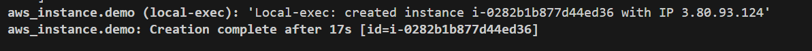
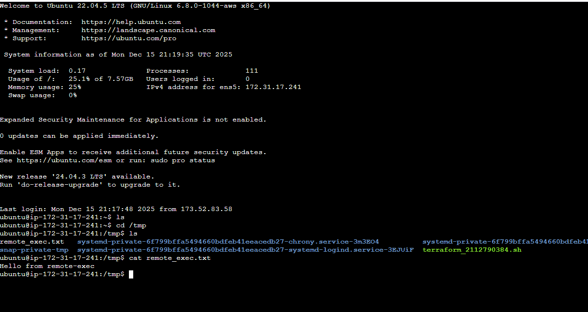
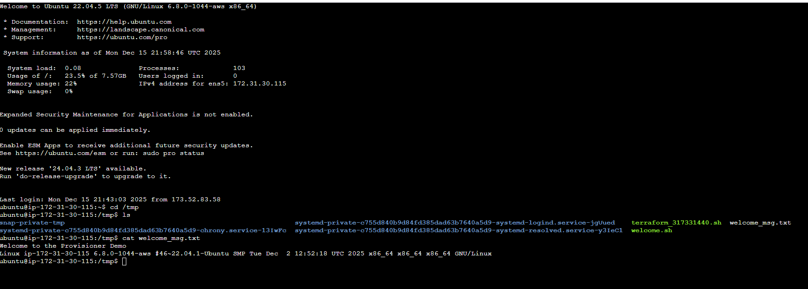

# Day 19 : Terraform Provisioners | #30DaysOfAWSTerraform


Today marks **Day 19** of the _30 Days of AWS Terraform_ challenge. In this post, we take a deep dive into **Terraform Provisioners**—what they are, why they exist, and how they fit into real-world infrastructure automation. We’ll explore the **different types of provisioners**, understand **when and when not to use them**, and walk through **practical, real-world scenarios** where provisioners can be helpful. The goal is to learn how provisioners can support **clean, effective Terraform code** while avoiding common pitfalls that lead to fragile infrastructure.

By the end of this blog, you’ll have a clear understanding of how Terraform provisioners work and how to apply them responsibly in production-ready IaC workflows.

## What Are Terraform Provisioners?

Provisioners are blocks you can place inside a resource declaration that allow Terraform to run actions associated with that resource’s lifecycle. They are usually used to:

-   Run a script or command locally or remotely
    
-   Bootstrap software on a newly created VM
    
-   Copy files to the remote system before execution
    

### Types of Terraform Provisioners

1.  local-exec : Runs on the machine running Terraform
    
2.  remote-exec : Runs on the the newly provisioned instance
    
3.  file: Runs on uploads files from local to remote
    

## local-exec: Run Commands Locally

The local-exec provisioner runs a command **on your local workstation or build machine** where you invoke terraform apply. This is **not** executed on the resource itself.

This is useful for tasks like:

-   Triggering scripts
    
-   Writing outputs to local files
    
-   Sending notifications
    

```
 resource "aws_instance" "demo" {
 #other configuration related to ec2
 provisioner "local-exec" {
     command = "echo 'Local-exec: created instance ${self.id} with IP ${self.public_ip}'"
  }
}
```

In the above block, we are just executing a simple echo command on the Terraform host machine.

The `command` argument accepts a **standard shell command**. In this case, we’re using `echo` to print a message. Inside that message, Terraform dynamically interpolates values from the EC2 resource—such as the **instance ID** and **public IP address.** Although the command runs **locally on the machine executing Terraform**, Terraform already has full knowledge of the resource being created. This allows it to safely substitute runtime values like:[self.id](http://self.id/) , self.public\_ip

The keyword `self` refers to **the current resource being created**. So when we use `self.public_ip`, we are simply referencing the **public IP address of this EC2 instance** that Terraform is managing.

`local-exec` always runs on your local system, not on the EC2 instance.



## Why the Provisioner Doesn’t Run Again Automatically

If you run `terraform apply` again at this point, Terraform may report **“no changes”**. That’s because provisioners **do not modify infrastructure state**—they only run during resource creation or destruction.

To re-trigger the provisioner, we need to **force Terraform to recreate the resource**. This can be done by marking the resource as _tainted_.

```
terraform taint aws_instance.demo
```

Tainting tells Terraform that the resource is unhealthy and must be **destroyed and recreated** during the next apply.

After tainting the resource, when we run `terraform apply` again:

1.  Terraform destroys the existing EC2 instance
    
2.  A new instance is created
    
3.  During creation, the `local-exec` provisioner executes
    
4.  The output displays the echoed message containing:
    
    -   The new instance ID
        
    -   The new public IP address
        

This clearly demonstrates how `local-exec` reacts to **infrastructure lifecycle events**.

## Terraform connection Block

When using `remote-exec` and `file` provisioners, Terraform needs a way to connect to the resource it just created. This is handled through the `connection` block.

The `connection` block defines **how Terraform establishes a remote session** with the target resource—most commonly over SSH for Linux instances.

```
  connection {
    type        = "ssh"
    user        = var.ssh_user
    private_key = file(var.private_key_path)
    host        = self.public_ip
  }
```

## remote-exec: Run Commands Remotely

The `remote-exec` provisioner runs commands **on the newly provisioned remote resource** (often a VM). This is ideal for bootstrapping or installing software.

It relies on a **connection block**, typically using SSH (Linux) or WinRM (Windows).

```
resource "aws_instance" "demo" {
 #other configuration related to ec2
provisioner "remote-exec" {
    inline = [
      "sudo apt-get update",
      "echo 'Hello from remote-exec' | sudo tee /tmp/remote_exec.txt",
    ]
  }
}
```

Instead of a single `command`, the `remote-exec` provisioner uses the `inline` argument. This allows us to define a **list of commands**, which Terraform executes **sequentially** on the remote machine. Each command in the list runs one after another, just as if we had manually SSH ed into the EC2 instance and typed them ourselve. Terraform establishes an SSH session with the instance and runs the commands remotely.

After running `terraform apply`, Terraform completes the resource creation and executes the `remote-exec` provisioner. To confirm that the commands actually ran on the EC2 instance, we can manually log in and check the file that was created. The `remote-exec` provisioner created the file inside the `/tmp` directory, so move there then list the files and display the content of the file created by Terraform, now you should see the message written by the `remote-exec` provisioner



## file: Copy Files to Remote Resources

The `file` provisioner copies files **from your local system** into the remote instance. This is useful for configuration files, scripts, or certificates you want available on the remote resource.

Pair it with `remote-exec` to copy then run a script. In real-world scenarios, writing long inline commands inside Terraform is not always practical. A cleaner and more maintainable approach is to **copy a script to the instance and execute it remotely**. This is where the combination of the `file` provisioner and `remote-exec` provisioner becomes extremely useful.

```
resource "aws_instance" "demo" {
 #other configuration related to ec2
  provisioner "file" {
    source      = "${path.module}/scripts/welcome.sh"
    destination = "/tmp/welcome.sh"
  }
}
```

-   `source`
    
    Refers to the script on your local machine.
    
    `path.module` ensures Terraform always resolves the correct directory, regardless of where the command is run from.
    
-   `destination`
    
    Specifies where the script will be placed on the EC2 instance.
    
    In this case, the script is copied to `/tmp/`[`welcome.sh`](http://welcome.sh/).
    

At this stage, Terraform has only **copied the file**—it has not executed anything yet.

```
resource "aws_instance" "demo" {
 #other configuration related to ec2
  provisioner "remote-exec" {
    inline = [
      "sudo chmod +x /tmp/welcome.sh",
      "sudo /tmp/welcome.sh"
    ]
  }
}
```

-   `chmod +x /tmp/`[`welcome.sh`](http://welcome.sh/)
    
    Grants execute permissions to the script.
    
-   `sudo /tmp/`[`welcome.sh`](http://welcome.sh/)
    
    Executes the script on the EC2 instance with elevated privileges.
    

These commands run **on the EC2 instance itself**, over SSH, using the connection details defined earlier.

After `terraform apply` completes, we can log in to the EC2 instance and verify that the script ran successfully.



erraform copies the [`welcome.sh`](http://welcome.sh/) script to the EC2 instance and executes it remotely. Once the provisioning completes, the script produces a simple output that helps us confirm successful execution.

The script creates a file named `/tmp/welcome_msg.txt` on the EC2 instance. This file contains:

-   A welcome message generated during provisioning
    
-   Basic system information from the instance itself
    

This confirms that the commands were executed **on the remote EC2 instance**, not on the local machine.

## Conclusion

Terraform provisioners extend Terraform’s infrastructure provisioning into **post-creation configuration tasks**. They’re simple and useful for quick automation, but should be used as a _last resort_ when native cloud features or configuration management tools aren’t suitable.

Terraform supports these key provisioners:

-   **local-exec** – runs local commands
    
-   **remote-exec** – runs remote commands on created resources
    
-   **file + remote-exec** – upload and run scripts on remote hosts
    

Use them wisely and keep your Terraform workflows safe, maintainable, and reproducible.

## Reference

https://www.youtube.com/watch?v=DkhAgYa0448&list=PLl4APkPHzsUXcfBSJDExYR-a4fQiZGmMp&index=21
