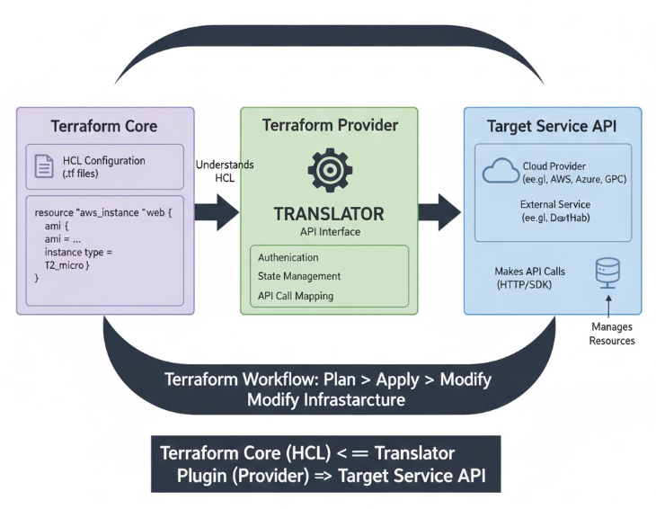
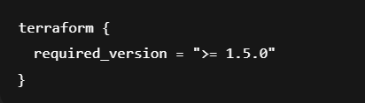
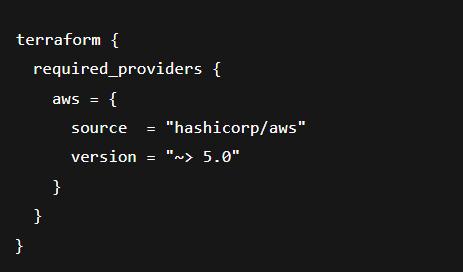
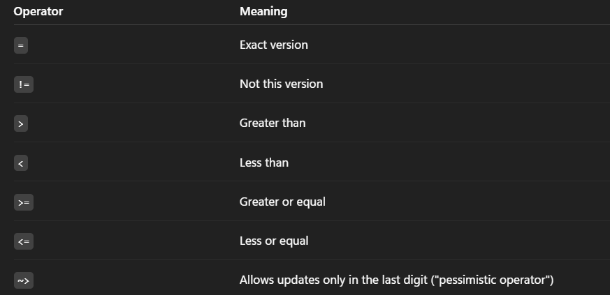
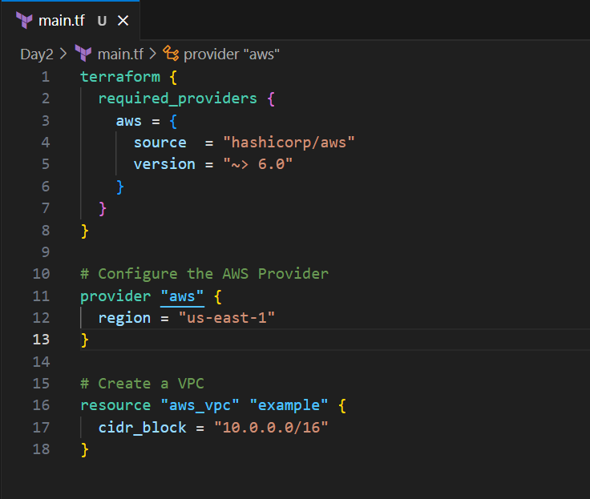
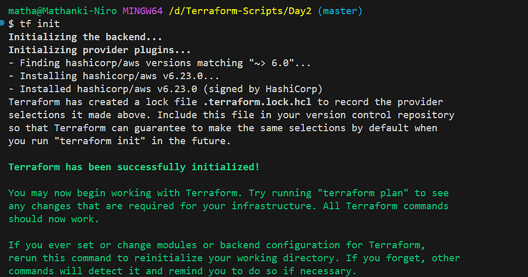
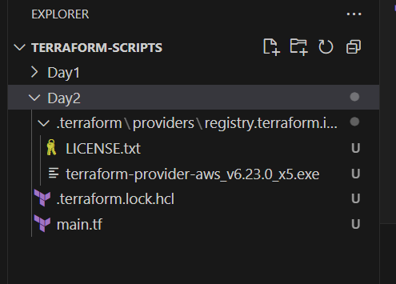
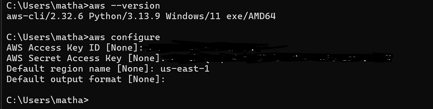
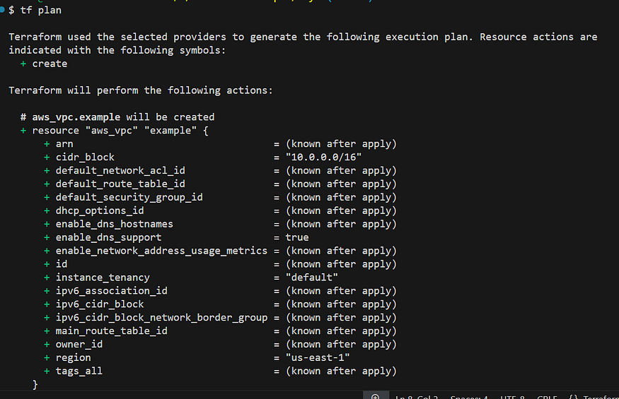

# Day 2: Understanding the AWS Provider in Terraform — #30DaysOfAWSTerraform

When working with Terraform, one of the core concepts you must understand early on is **Providers**. Providers act as the bridge between Terraform and the platform you want to manage — whether it’s AWS, Azure, GCP, GitHub, Kubernetes, or many others.

Today, let’s break down Terraform Providers, versioning, constraints, and why they matter.

### What Are Terraform Providers?

A **Terraform Provider** is the **plugin** that acts as a translator and interface between the Terraform Core engine and the external service or infrastructure you want to manage (like AWS, Azure, Google Cloud, Docker, or GitHub).

It is the core component that allows Terraform to be “cloud-agnostic.” Terraform Core only knows HCL (HashiCorp Configuration Language), but the provider knows how to turn HCL definitions into specific API calls.

Press enter or click to view image in full size

### Breakdown of the Workflow:

1.  User Writes HCL Configuration:

-   You define your desired infrastructure in `.tf` files using **HashiCorp Configuration Language (HCL)**.
-   This includes `provider` blocks (specifying the cloud/service) and `resource` blocks (defining specific components like virtual machines, databases, etc.).

2\. terraform init:

-   When you run `terraform init`, Terraform Core reads your `.tf` files.
-   It identifies which providers are declared (e.g., `aws`, `azurerm`).
-   It then consults the **Terraform Registry** (`registry.terraform.io`) to find and download the appropriate **provider plugin** (which is a standalone executable binary, usually written in Go).
-   This plugin is stored locally in the hidden `.terraform` directory.

3\. Terraform Core (Plan/Apply Logic):

-   Terraform Core loads the downloaded provider plugin.
-   For commands like `terraform plan` or `terraform apply`, Terraform Core calculates the **desired state** from your HCL.
-   It then consults the provider to get the **current real-world state** of the resources defined in your configuration (by making API calls through the provider).
-   By comparing the desired state with the current state and the **Terraform State File (**`**.tfstate**`**)**, Terraform Core determines the necessary **CRUD (Create, Read, Update, Delete)** operations.
-   It then sends these instructions to the loaded **Provider Plugin**.

4\. Terraform Provider Plugin:

-   The provider plugin receives these instructions from Terraform Core.
-   It handles **authentication** with the target service using the credentials you provide in the `provider` block (or environment variables).
-   It translates the abstract resource definitions and desired actions (e.g., “create an `aws_instance` with these properties") into **specific, low-level API requests** that the target service understands (e.g., a `RunInstances` API call for AWS EC2).
-   It builds and sends these API calls (often using the service’s SDK) to the **Target Service API**.

5\. Target Service API & External Service:

-   The **Target Service API** (e.g., AWS’s EC2 API, Azure’s Resource Manager API) receives the API calls.
-   It processes these requests, provisions, modifies, or deletes the actual **External Service/Cloud Provider Resources** (e.g., an EC2 instance is created, a storage account is updated).
-   The API returns a response to the provider, including success/failure status and details about the newly created/modified resource.

6\. State Management:

-   The provider receives the API response and relays it back to Terraform Core.
-   Terraform Core then updates the **Terraform State File (**`**.tfstate**`**)** with the latest information about the managed resources. This state file is crucial for Terraform to know what infrastructure it manages and its current configuration.
-   For team environments, this state file is often stored in a **Remote State Backend** (like S3, Azure Blob Storage, or Terraform Cloud) to ensure consistency and prevent conflicts.

### Types of Terraform Providers

The categorization of Terraform Providers reflects their **source, maintenance level, and reliability**. This classification helps users understand the quality, support, and long-term viability of a provider plugin.

Here is an explanation of the three main categories:

1.  Official Providers:

-   They are developed and actively maintained by either **HashiCorp** (the creators of Terraform) or by the **vendor/organization that owns the service** being managed (e.g., AWS, Microsoft, Google, or Kubernetes).
-   These providers are typically the most stable, feature-complete, and up-to-date, offering quick support for new service features and security patches.
-   **Examples:** Providers maintained by HashiCorp (e.g., `hashicorp/aws`, `hashicorp/azurerm`).
-   Providers maintained by a major cloud vendor or service (often officially supported by HashiCorp).

2\. Partner Providers:

Partner Providers are maintained by organizations that have a formal relationship with HashiCorp.

-   They are developed and maintained by **third-party commercial organizations** (e.g., Splunk, Datadog, Cloudflare) that offer products or services integratable with infrastructure as code.
-   While not directly maintained by HashiCorp, these providers offer a high degree of confidence because their maintainers are verified and committed partners. They are generally well-documented and professionally supported by the company that owns the service.
-   **Examples:** Providers for commercial SaaS platforms or specialized infrastructure tools.

3\. Community Providers:

Community Providers are developed and maintained by individuals or groups within the open-source community.

-   They are created and maintained by **independent users, smaller companies, or the broader public**.
-   This category has the **highest variability** in quality, maintenance, and responsiveness. Some community providers are excellent and well-maintained, while others may be abandoned or lack up-to-date features. You rely on the goodwill and availability of the community maintainers.
-   **Examples:** Providers for highly niche or specialized APIs, small local infrastructure tools, or services that don’t yet have official or partner support.

### Terraform Versioning & Provider Versioning and Configuration

Versioning is one of the most important concepts in Terraform because it ensures **stability**, **compatibility**, and **predictable behavior** when managing infrastructure. Terraform relies on two major types of versioning:

1.  **Terraform Core Versioning**

Terraform Core is the main engine that drives the language syntax, state management, and plan/apply lifecycle.

You can lock the minimum (or exact) Terraform version using the **required\_version** argument inside the terraform block:

**Why Terraform Core Versioning Matters:**

-   **Prevents breaking changes** when newer releases introduce backward-incompatible updates.
-   **Ensures your team uses the same version** to avoid inconsistent behavior.
-   Helps maintain **reproducible infrastructure deployments**.

**2\. Provider Versioning** (e.g., AWS, Azure, GCP providers)

Terraform Providers are plugins that let Terraform interact with cloud platforms such as AWS, Azure, GCP, Kubernetes, etc.

Each provider has its own version lifecycle, independent of Terraform Core.

You define provider version constraints using **required\_providers**:

Why Provider Versioning Matters:

. Providers frequently release updates including:

-   New resource support
-   Deprecated fields
-   Bug fixes
-   Breaking changes

. Locking version constraints ensures your infrastructure behaves the same way every time you run Terraform.

### Understanding Version Constraints

Terraform uses semantic versioning (MAJOR.MINOR.PATCH).

Some common operators:

Press enter or click to view image in full size

Example: version = “~> 5.1” this mean allowed: 5.1.1, 5.1.9 and not allowed: 5.2.0, 6.0.0

### First Terraform Script

Press enter or click to view image in full size

This Terraform script does 3 main things:

1.  Specifies which provider (AWS) Terraform should use:

-   `**required_providers**` tells Terraform which provider plugins are needed.
-   `**aws**` is the provider name.
-   `**source = "hashicorp/aws"**` means the provider is downloaded from the official HashiCorp registry.

`**. version = "~> 6.0"**` means:

-   Use AWS provider version **6.0 or any newer patch**, like 6.1, 6.5, 6.9…
-   But **NOT** 7.0 or above
    
    This keeps your module stable even when providers release new breaking versions.

2\. Configures the AWS provider settings (region)

This config tells Terraform:

-   Use AWS services from the region: **us-east-1** (N. Virginia)

Terraform needs this to know **where** to create resources.

If you don’t set a region, Terraform will throw an error.

3\. Creates an AWS VPC resource

You are creating a **VPC** (Virtual Private Cloud) in AWS.

-   `**resource "aws_vpc" "example"**`
-   `aws_vpc` → Resource type
-   `example` → Logical name (you choose this)

`**cidr_block = "10.0.0.0/16"**`

-   This defines the IP address range for your VPC.
-   **/16** means you get **65,536 IP addresses**.

### When you run: terraform init

Terraform downloads the AWS provider plugin (version ~> 6.0)

Press enter or click to view image in full size

Need to install aws cli and configure aws credentials using access key and secret key in order to proceed further.

Press enter or click to view image in full size

tf plan shows what changes Terraform will make to your infrastructure before actually applying them.

Press enter or click to view image in full size

When execute tf plan terraform does the following:

1.  **Reads your** `**.tf**` **files**
2.  **Loads the current state** (from `terraform.tfstate`)
3.  **Queries the cloud provider (AWS, Azure, GCP)** to get the real infrastructure state
4.  **Compares**:

-   Desired state (your code)
-   Actual state (cloud)

5\. Generates an **execution plan**

This plan is only a **preview**, not an actual change.

### Conclusion

Terraform simplifies cloud infrastructure management by allowing you to define resources through clean, readable configuration files. Providers serve as the bridge between Terraform and external services like AWS, while versioning ensures your deployments remain predictable, stable, and free from unexpected updates.

With essential commands — such as `terraform init` to prepare your environment and `terraform plan` to preview upcoming changes—you can confidently create, update, and manage resources safely. Beginning with foundational components like a VPC builds a strong understanding of Terraform’s workflow, and as your skills grow, the tool empowers you to automate and scale infrastructure with consistency and reliability across any environment

### Reference Guide

[https://www.youtube.com/watch?v=JFiMmaktnuM&list=PLl4APkPHzsUXcfBSJDExYR-a4fQiZGmMp&index=5](https://www.youtube.com/watch?v=JFiMmaktnuM&list=PLl4APkPHzsUXcfBSJDExYR-a4fQiZGmMp&index=5)
