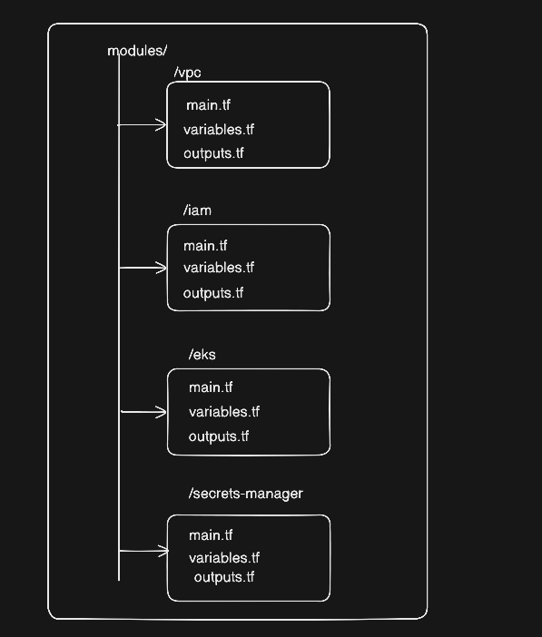
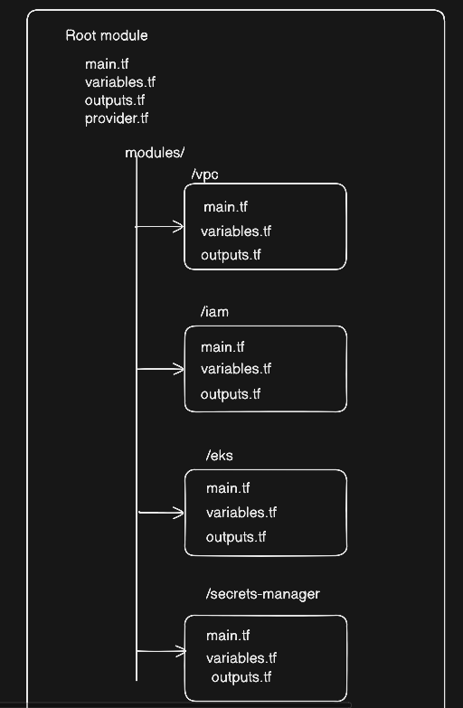

# Day 20 : Terraform Custom Modules for EKS | #30DaysOfAWSTerraform


Welcome to **Day 20** of the **30 Days of AWS Terraform Challenge,** As progress continues through the **Infrastructure as Code (IaC)** journey, it becomes clear that as projects grow, code can become repetitive and difficult to manage. Today marks a deep dive into the most powerful tool for scaling infrastructure: **Terraform Modules**.

## What Is a Terraform Module?

In Terraform, a **Module** is a self-contained package of configuration code that groups related resources together. Rather than writing long, monolithic files, modules allow for the encapsulation of complex logic into reusable components.

In traditional programming, logic is organized into **functions**. In Terraform, modules serve that exact purpose. The logic is defined once, and then executed multiple times across different environments or projects using different parameters.

Every Terraform project already contains a module:

-   The directory where you run `terraform init` is called the **root module**
    
-   Any directory referenced using a `module` block is a **child module**
    

Modules allow you to:

-   Avoid code duplication
    
-   Enforce consistent infrastructure patterns
    
-   Simplify complex infrastructure logic
    

## Types of Terraform Modules

Terraform modules generally fall into **three categories**:

1.  Public Modules
    
2.  Partner Modules
    
3.  Custom Modules
    

## Public Modules

**Public modules** are openly available modules published on the **Terraform Registry**.

### Who Creates Them?

-   AWS
    
-   HashiCorp
    
-   Google Cloud (GCP)
    
-   Microsoft Azure
    
-   Open-source contributors
    

### Examples

-   AWS VPC module
    
-   AWS EKS module
    
-   Terraform Kubernetes modules
    

Best For fast prototyping or learning best practices from the global community. Since anyone can publish them, the quality and maintenance can vary. It is important to check the "downloads" count and "last updated" date.

## Partner Modules

**Partner modules** are officially supported modules built by **cloud partners in collaboration with HashiCorp**.

They are rigorously tested and follow the official best practices of the specific platform. For example, the `terraform-aws-modules/vpc/aws` is the industry standard for AWS networking.

Best For Mission-critical production infrastructure where stability and official support are required.

## Custom Modules

Custom modules are built internally within an organization to meet specific business requirements that public modules might not cover.

Internal DevOps or Platform Engineering teams create it.

**Why Custom Modules Matter**

Every organization has:

-   Its own security requirements
    
-   Naming conventions
    
-   Network designs
    
-   Compliance rules
    

Custom modules allow you to encode these standards **once** and reuse them everywhere.

In today's blog, the focus is on demonstrating how to build a **Custom Terraform Module** specifically for a production-ready **Amazon EKS (Elastic Kubernetes Service)** cluster.

Deploying EKS is a complex task because it involves orchestrating multiple AWS services. By encapsulating this logic into a custom module, the complexity is managed in one place, allowing for repeatable and consistent cluster deployments.



## VPC Module (modules/vpc/)

The module is designed to create a secure, highly available networking environment. It encapsulates the following components:

**VPC with Custom CIDR:** The module initializes a VPC with a user-defined CIDR block and enables DNS hostnames and support, which are essential for EKS operations.

**Public Subnets:** It creates public subnets across specified Availability Zones (AZs) and automatically maps public IPs on launch for resources within these subnets

**Private Subnets:** It establishes private subnets across the same AZs to host worker nodes securely away from the public internet

**Internet Gateway (IGW):** An IGW is deployed to provide the VPC with a connection to the public internet.

**NAT Gateway:** To allow private subnets to communicate with the internet (for updates or pulling images) without being exposed, the module deploys NAT Gateways using Elastic IPs.

**Flexible NAT Configuration:** Users can choose to deploy a single NAT Gateway for cost-efficiency or multiple gateways for higher redundancy.

**Route Tables:** The module automatically manages public and private route tables.

**Automatic Associations:** It handles the complex logic of associating each subnet with the correct route table and creating the necessary routes to the IGW or NAT Gateway.

**EKS-Required Subnet Tags:** Through the `public_subnet_tags` and `private_subnet_tags` variables, the module allows for the specific tagging required by AWS to help the EKS control plane discover and manage subnets.

## **IAM Module (modules/iam/)**

This module manages the security and identity foundation for the EKS cluster. It focuses on creating the necessary **IAM Roles** and **Policy Attachments** that allow the Kubernetes control plane and its worker nodes to interact securely with other AWS services.

1.  **EKS Cluster IAM Role**
    
    This role is assumed by the **Amazon EKS service** itself. It allows the Kubernetes control plane to manage AWS resources (like Load Balancers and Security Groups) on your behalf.
    
    -   **Managed Policies Attached:**
        
        -   `AmazonEKSClusterPolicy`: The core policy providing permissions to manage the cluster.
            
        -   `AmazonEKSVPCResourceController`: Allows the cluster to manage network interfaces and security groups for pods.
            
2.  **Node Group IAM Role**
    
    This role is assigned to the **EC2 worker nodes**. It defines what the servers running your containers are allowed to do within the AWS ecosystem.
    
    -   **Managed Policies Attached:**
        
        -   `AmazonEKSWorkerNodePolicy`: Grants the nodes permission to connect to the EKS cluster.
            
        -   `AmazonEKS_CNI_Policy`: Essential for the VPC CNI plugin to manage pod networking and IP addresses.
            
        -   `AmazonEC2ContainerRegistryReadOnly`: Allows the nodes to pull private images from Amazon ECR.
            

## **EKS Module (modules/eks/)**

The EKS module follows a structured workflow to create a production-ready Kubernetes environment. It uses **Terraform providers** (the AWS plugin) to talk to the Amazon APIs and build resources in a specific order based on their dependencies

**Security & Identity Foundation (First Step)**

Before the cluster can exist, Terraform creates the "rules" and "permissions":

-   **IAM Roles**: It provisions the IAM roles for both the cluster and the nodes. These roles allow AWS to manage the control plane and allow nodes to join the cluster.
    
-   **Security Groups**: It creates the virtual firewalls that define how the control plane and worker nodes communicate with each other.
    
-   **KMS Key**: A dedicated encryption key is generated to protect your Kubernetes secrets.
    

**EKS Control Plane Creation**

Once the permissions are in place, the module initiates the `aws_eks_cluster` resource:

-   **API Server**: AWS provisions the Kubernetes control plane.
    
-   **Logging**: It creates a **CloudWatch Log Group** and tells EKS to stream system logs (like Audit and API logs) there for troubleshooting.
    
-   **Encryption**: It attaches the KMS key to the cluster to encrypt internal data.
    

**Managed Compute (Node Groups)**

After the control plane is "Active," the module begins building the compute layer where your apps will run:

-   **Launch Templates**: It creates EC2 Launch Templates which act as a "blueprint" for your worker nodes (defining disk size, instance type, and security settings).
    
-   **Auto Scaling**: It creates **Managed Node Groups**, which automatically spin up EC2 instances into the subnets you provided.
    

**Networking & Add-ons (Final Step)**

Finally, the module "finishes" the cluster by installing essential software:

-   **EKS Add-ons**: It deploys **CoreDNS** (for discovery), **kube-proxy** (for networking), and the **VPC CNI** (for pod IP addresses) directly into the Kubernetes API.
    
-   **OIDC Provider**: If enabled, it creates an identity provider so you can give IAM permissions to specific pods later.
    

## **Secrets Manager Module (modules/secrets-manager/)**

The **Secrets Manager Module** creates a secure environment for storing and accessing sensitive information by managing both the secrets themselves and the encryption/access layers.

**Encryption and Security**

-   **KMS Key**: Creates a dedicated AWS KMS key (`aws_kms_key`) used specifically for encrypting the secrets at rest. It includes a rotation period and a deletion window for security best practices.
    
-   **KMS Alias**: Creates a user-friendly alias (`aws_kms_alias`) for the KMS key to make it easier to reference (e.g., `alias/${name_prefix}-secrets`).
    

**Managed Secrets**

The module can conditionally create up to three types of secrets based on input variables:

-   **Database Credentials**: A secret (`aws_secretsmanager_secret`) to store database connection details like username, password, engine, host, and port.
    
-   **API Keys**: A secret for storing sensitive API keys and secrets.
    
-   **Application Config**: A secret for general application configuration that needs to remain sensitive, such as environment-specific settings.
    

**Secret Versions**

-   For each secret created, the module also manages an **Initial Version** (`aws_secretsmanager_secret_version`). This resource takes the raw input data (like database passwords or API keys) and stores it as a JSON-encoded string within the secret.

**Access Management**

-   **IAM Policy**: A read-only IAM policy (`aws_iam_policy`) that grants permissions to `GetSecretValue` and `DescribeSecret`.
    
-   **Scoped Permissions**: This policy is automatically scoped to only allow access to the specific ARNs of the secrets created by this module, adhering to the principle of least privilege.
    

## Root module and child modules interaction



**Passing Data: Root to Child (Inputs):**

In the Terraform hierarchy, the **Root Module** acts as the orchestrator. When it calls a **Child Module**, it must provide the necessary configuration data. This is achieved through **Input Variables**. Think of a child module as a function in programming. To make the function run, the main program must pass "arguments" to it. Variables are declared in the child module’s [`variables.tf`](http://variables.tf/) file. The root module "injects" values into these variables within the `module` block. Child modules are encapsulated; they cannot see variables in the root module unless they are explicitly passed down.

```
# modules/vpc/variables.tf (Child Module)
variable "vpc_cidr" {
  type        = string
  description = "The CIDR block for the VPC"
}

# main.tf (Root Module)
module "vpc" {
  source   = "./modules/vpc"
  vpc_cidr = "10.0.0.0/16" # Data flows from Root to Child here
}
```

**Passing Data: Child to Root (Outputs)**

Once a child module provisions infrastructure, the resulting data (like a VPC ID or an ARN) is often needed by the rest of the configuration. **Outputs** are the mechanism used to "bubble up" information from the child to the root. Outputs are declared in the child module’s [`outputs.tf`](http://outputs.tf/) file. Once defined, the root module can reference these values using the syntax `module.<MODULE_NAME>.<OUTPUT_NAME>`. This allows the root module to use resource attributes that are only known _after_ the child module has executed (e.g., an auto-generated ID)

Example: When a child module like the VPC creates resources, it encapsulates those details. To make specific information—such as a VPC ID—available to the rest of the configuration, the child must explicitly "export" it using **Outputs.**

Inside the `modules/vpc/` directory, an [`outputs.tf`](http://outputs.tf/) file (or similar) defines which attributes are public. For example, to share the ID of the VPC once it is created, the child module would contain a block like this:

```
# modules/vpc/outputs.tf

output "vpc_id" {
  description = "The ID of the VPC"
  value       = aws_vpc.this.id # This "exports" the ID attribute of the VPC resource
}

output "private_subnets" {
  description = "List of IDs of private subnets"
  value       = aws_subnet.private[*].id # Exports the list of generated subnet IDs
}
```

Once the child module defines these outputs, the Root module "captures" them. This is done using the syntax `module.<MODULE_NAME>.<OUTPUT_NAME>`. In the provided [`main.tf`](http://main.tf/), the Root module calls the VPC module and then immediately uses those exported values to configure the EKS module:

```
# main.tf (Root Module)

# 1. Call the VPC Module
module "vpc" {
  source = "./modules/vpc"
  # ... inputs like cidr and azs ...
}

# 2. Access the VPC's outputs to configure the EKS Module
module "eks" {
  source     = "./modules/eks"

  # The Root module "captures" the vpc_id and private_subnets from the vpc module
  # and passes them as inputs to the eks module.
  vpc_id     = module.vpc.vpc_id          # Accessing the vpc_id output [cite: 3]
  subnet_ids = module.vpc.private_subnets # Accessing the private_subnets output [cite: 3]

  # ... other EKS configurations ...
}
```

**Inter-Module Communication**

A common architectural requirement is for two child modules to share data—for example, a Security Group module needing a VPC ID created by a VPC module.

In Terraform, **child modules cannot communicate directly with each other.** All communication must be brokered by the Root Module.

1.  **Step 1:** The first child module exports a value via an `output`.
    
2.  **Step 2:** The Root Module captures that output.
    
3.  **Step 3:** The Root Module passes that value into the second child module as an `input`.
    

This "Middleman" pattern ensures that dependencies are clearly mapped in the root configuration, allowing Terraform to build a proper dependency graph.

Inside the first child module (e.g., the VPC module), you must define an `output` block. This makes internal data—like a VPC ID—available to the Root Module

Inside `modules/vpc/`[`outputs.tf`](http://outputs.tf/)

```
output "vpc_id" {
  description = "The ID of the VPC"
  value       = aws_vpc.this.id # This "exports" the value up to the Root
}

output "private_subnets" {
  description = "List of private subnet IDs"
  value       = aws_subnet.private[*].id
}
```

The Root Module ([`main.tf`](http://main.tf/)) calls the first module and captures its output using the syntax `module.<MODULE_NAME>.<OUTPUT_NAME>`

In [`main.tf`](http://main.tf/):

```
module "vpc" {
  source = "./modules/vpc"
  # ... configuration ...
}

# The Root module now "knows" the value of:
# module.vpc.vpc_id
```

The Root Module then takes that captured value and passes it into the second child module as a variable. This second module must have a corresponding `variable` defined to receive it.

In [`main.tf`](http://main.tf/):

```
module "eks" {
  source = "./modules/eks"

  # BROKERING DATA:
  # Capturing output from 'vpc' and passing it to 'eks' input variables
  vpc_id     = module.vpc.vpc_id
  subnet_ids = module.vpc.private_subnets

  # Capturing output from 'iam' and passing it to 'eks' input variables
  cluster_role_arn = module.iam.cluster_role_arn
  node_role_arn    = module.iam.node_group_role_arn
}
```

dependency Graph**:** Because `module.eks` references `module.vpc`, Terraform automatically builds a dependency graph. It understands it must finish building the VPC resources _before_ it starts building the EKS cluster.

Decoupling**:** The EKS module is "dumb"—it doesn't know where the `vpc_id` comes from. It just knows it needs one. This allows to replace the VPC module with a different network source later without changing any code inside the EKS module itself.

Explicit Mapping**:** All data flow is visible in the [`main.tf`](http://main.tf/) file. You don't have to go digging into hidden module files to understand how your network and compute layers are connected.

## **Execution:**

```
terraform init
terraform plan
terraform apply
```

By executing the above commands you could see the infrastructure getting created, first VPC and IAM will be created parallely followed by EKS.

## Conclusion

Custom Terraform modules transform infrastructure from simple scripts into **well-architected systems**. In the context of Amazon EKS, modular design is what separates a one-time demo cluster from a **scalable, secure, and production-grade Kubernetes platform**.

By breaking infrastructure into focused, reusable modules, teams gain consistency across environments, reduce operational risk, and enable safer, version-controlled changes. Modules also promote clear ownership, easier troubleshooting, and faster onboarding for new engineers.

As EKS environments grow in size and complexity, this modular approach becomes essential. Investing early in well-designed Terraform modules pays long-term dividends by making your infrastructure predictable, maintainable, and ready for production workloads.

## Reference

https://www.youtube.com/watch?v=a_j6Gq-KtxE&list=PLl4APkPHzsUXcfBSJDExYR-a4fQiZGmMp&index=25
