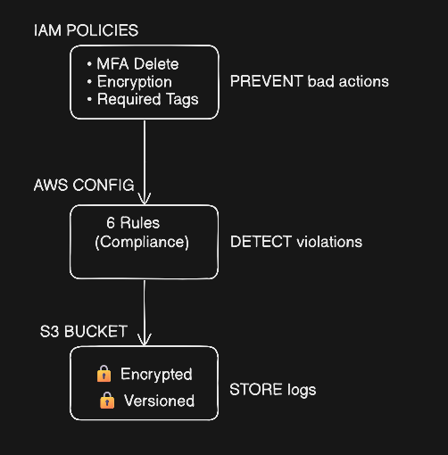
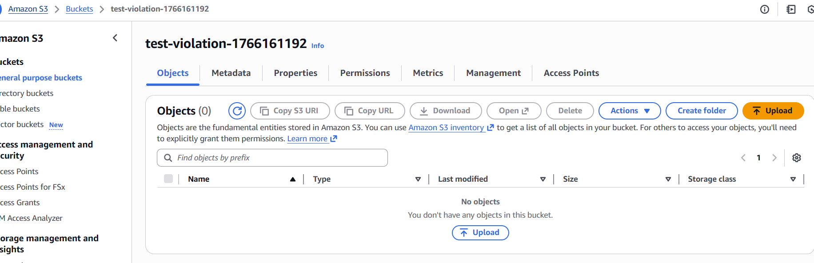
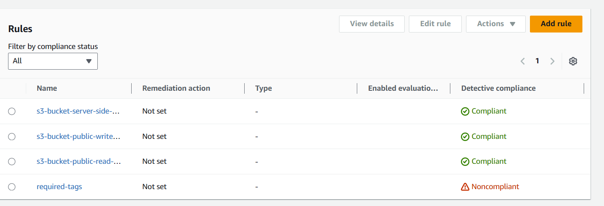

# Day 21 : AWS Policy and Governance with Terraform | #30DaysOfAWSTerraform


Cloud governance is not optional in modern AWS environments—it is essential. As infrastructure scales, organizations must enforce **security controls, compliance rules, and operational standards automatically**.

In **Day 21 of the AWS Terraform journey**, this mini project demonstrates how to implement **AWS Policy Creation and Governance** using **Terraform as Infrastructure as Code (IaC)**. The project focuses on enforcing security guardrails, tagging standards, encryption requirements, and continuous compliance monitoring using **IAM and AWS Config**.

## What is AWS Governance?

**AWS Governance** is the framework of policies, controls, and monitoring mechanisms used to ensure that AWS environments are **secure, compliant, cost‑effective, and aligned with organizational standards**.

As cloud environments grow, manual checks are no longer reliable. AWS Governance enables teams to **automatically enforce rules**, continuously monitor resources, and maintain visibility across accounts and services.

At a high level, AWS Governance is implemented using **two types of controls**:

1.  **Peventive Controls (IAM Policies)**
    
    Preventive controls stop non‑compliant actions before they happen**.** They act as guardrails that block insecure or unauthorized operations.
    
    #### Key Characteristics:
    
    -   Enforced before a resource is created or modified
        
    -   Implemented using **IAM policies, conditions, and explicit denies**
        
    -   Help avoid misconfigurations and security risks proactively
        

#### Examples :

-   **MFA Delete Policy** – Denies S3 object deletion unless MFA is enabled
    
-   **S3 Encryption in Transit Policy** – Blocks S3 uploads over HTTP
    
-   **Required Tags Policy** – Prevents EC2 creation without `Environment` and `Owner` tags
    

Preventive controls reduce human error and enforce security by design.

2.  **Detective Controls (AWS Config)**
    
    Detective controls identify and report non‑compliant resources after they are created**.** They provide visibility and continuous compliance monitoring.
    
    #### Key Characteristics:
    
    -   Evaluate resources **after deployment**
        
    -   Continuously monitor configuration changes
        
    -   Identify drift from compliance standards
        
    -   Enable auditing and reporting
        

#### Examples :

-   Detects publicly accessible S3 buckets
    
-   Flags unencrypted EBS volumes
    
-   Identifies missing mandatory tags
    
-   Ensures IAM password policy and root MFA compliance
    

Detective controls ensure ongoing compliance and audit readiness.

## Core Components of AWS Governance

AWS Governance ensures cloud environments remain **secure, compliant, and well-managed** as they scale. It is built on several foundational components that work together to enforce controls and maintain visibility.

1.  **Identity and Access Management (IAM)**
    
    IAM controls **who can access AWS resources and what actions they can perform**.
    
    -   Defines users, roles, and permissions
        
    -   Enforces least-privilege access
        
    -   Secures access using MFA and temporary credentials
        

Example**:** IAM policies deny insecure actions, enforce MFA, and restrict access using explicit deny rules.

2.  **Policy Enforcement & Guardrails**
    
    Policies act as **preventive controls** that block non-compliant actions before they occur.
    
    -   Explicit deny policies override all allows
        
    -   Guardrails prevent human error
        
    -   Enforces organizational standards automatically
        

Example**:** Policies deny S3 deletion without MFA, block unencrypted traffic, and enforce tagging.

3.  **Configuration & Compliance Management (AWS Config)**
    
    AWS Config continuously records and evaluates resource configurations.
    
    -   Tracks configuration changes
        
    -   Evaluates resources against compliance rules
        
    -   Provides audit-ready reports
        

Example**:** AWS Config monitors S3, EBS, IAM, tagging, and root account security.

4.  **Logging, Monitoring & Auditing**
    
    Governance requires visibility into **what changed, who changed it, and when**.
    
    -   AWS Config records configuration history
        
    -   S3 stores compliance data securely
        
    -   IAM roles ensure controlled access
        
5.  **Resource Tagging & Cost Governance**
    
    Tagging provides structure and accountability.
    
    -   Enables cost allocation
        
    -   Identifies ownership
        
    -   Supports automation and compliance
        

Example**:** EC2 creation is denied unless required tags are present.

6.  **Data Protection & Security Controls**
    
    Data governance ensures information is protected at all times.
    
    -   Encryption in transit and at rest
        
    -   MFA enforcement
        
    -   Secure storage for audit logs
        
7.  **Continuous Compliance**
    
    Governance is an ongoing process.
    
    -   AWS Config continuously evaluates resources
        
    -   Non-compliant resources are flagged automatically
        
    -   Enables remediation and reporting
        

## AWS Policy Types

AWS uses different policy types to enforce security and governance at multiple layers.

1.  **Identity-Based Policies**
    
    Attached to IAM users, groups, or roles to define **what actions are allowed or denied**.
    
    -   Managed or custom policies
        
    -   Core mechanism for access control
        

Example**:** Custom IAM policies enforcing MFA, encryption, and tagging.

2.  **Resource-Based Policies**
    
    Attached directly to AWS resources to define **who can access them**.
    
    -   Common with S3, SNS, SQS, Lambda
        
    -   Supports cross-account access
        
3.  **Service Control Policies (SCPs)**
    
    Used with AWS Organizations to define **maximum permissions** for accounts.
    
    -   Do not grant permissions
        
    -   Act as organizational guardrails
        
4.  **Permissions Boundaries**
    
    Limit the **maximum permissions** an IAM role or user can receive.
    
    -   Prevent privilege escalation
        
    -   Useful in delegated administration
        
5.  **Session Policies**
    
    Temporarily restrict permissions during a session.
    
    -   Applied when assuming roles
        
    -   Ideal for short-term access
        
6.  **AWS Config Rules (Compliance Policies)**
    
    Evaluate resource configurations against compliance standards.
    
    -   Detect misconfigurations
        
    -   Enable continuous compliance
        

Example**:** S3 security, EBS encryption, tagging, IAM password policy, and root MFA.

## Project **Architecture**



In cloud security, "one and done" isn't enough. A resilient architecture requires multiple layers of defense that not only stop bad actors but also watch for mistakes and record everything for audit.

## The Preventative Layer (IAM Policies)

The following IAM policies are created to enforce security and governance requirements. To stop unauthorized or insecure actions before they ever happen.

1.  ### MFA Delete Policy
    
    The `mfa_delete_policy` uses a `Deny` statement with a condition. It ensures that even if a user has delete permissions, they are blocked unless they have authenticated with a second factor.
    

```
resource "aws_iam_policy" "mfa_delete_policy" {
  name        = "${var.project_name}-mfa-delete-policy"
  description = "Policy that requires MFA to delete S3 objects"

  policy = jsonencode({
    Version = "2012-10-17"
    Statement = [
      {
        Sid      = "DenyDeleteWithoutMFA"
        Effect   = "Deny"
        Action   = "s3:DeleteObject"
        Resource = "*"
        Condition = {
          BoolIfExists = {
            "aws:MultiFactorAuthPresent" = "false"
          }
        }
      }
    ]
  })
}
```

Uses an **explicit Deny**, which always overrides Allow. Blocks `s3:DeleteObject` when MFA is not present. Protects S3 data from accidental or unauthorized deletion.

Governance Value: Enforces strong authentication for destructive actions

2.  ### S3 Encryption in Transit Policy
    
    Require HTTPS/TLS for S3 uploads. The `enforce_s3_encryption_transit` policy denies `s3:PutObject` if the request does not use a secure connection (`aws:SecureTransport` is "false")
    

```
resource "aws_iam_policy" "enforce_s3_encryption_transit" {
  name        = "${var.project_name}-s3-encryption-transit"
  description = "Deny S3 actions without encryption in transit"

  policy = jsonencode({
    Version = "2012-10-17"
    Statement = [
      {
        Sid      = "DenyUnencryptedObjectUploads"
        Effect   = "Deny"
        Action   = "s3:PutObject"
        Resource = "*"
        Condition = {
          Bool = {
            "aws:SecureTransport" = "false"
          }
        }
      }
    ]
  })
}
```

Denies uploads over insecure HTTP. Forces encrypted communication using HTTPS

Governance Value**:** Ensures data is encrypted in transit

3.  ### Required Tags Policy
    
    Enforce organizational tagging standards at resource creation. The `require_tags_policy` prevents EC2 instance creation (`ec2:RunInstances`) unless specific `Environment` tags ("dev", "staging", or "prod") and an `Owner` tag are provided in the request.
    
    Environment Tag:
    
    ```
     StringNotLike = {
     "aws:RequestTag/Environment" = ["dev", "staging", "prod"]
     }
    ```
    
    Owner Tag:
    

```
Null = {
"aws:RequestTag/Owner" = "true"
}
```

Denies EC2 instance creation if:

-   `Environment` tag is missing or invalid
    
-   `Owner` tag is not provided
    

Enforcement happens **before the resource is created**

Governance Value: Enables cost tracking, ownership, and policy automation

4.  ### Demo IAM User
    
    Demonstrate policy enforcement safely.
    

```
resource "aws_iam_user" "demo_user" {
name = "${var.project_name}-demo-user"
}
```

Policy Attachment

```
resource "aws_iam_user_policy_attachment" "demo_user_mfa" {
user = aws_iam_user.demo_user.name
policy_arn = aws_iam_policy.mfa_delete_policy.arn
}
```

Sample IAM user created for governance testing

MFA delete policy attached to demonstrate enforcement

### AWS Config IAM Role

Allows AWS Config to assume the role securely. Uses temporary credentials (best practice)

```
resource "aws_iam_role" "config_role" {
  name = "${var.project_name}-config-role"

  assume_role_policy = jsonencode({
    Version = "2012-10-17"
    Statement = [
      {
        Action = "sts:AssumeRole"
        Effect = "Allow"
        Principal = {
          Service = "config.amazonaws.com"
        }
      }
    ]
  })
}
```

## Detective Layer: AWS Config

This layer continuously monitors resources to detect and flag any configurations that deviate from the established security baseline. AWS Config is enabled to continuously evaluate AWS resources against compliance rules. AWS Config is used as a **detective governance control** to continuously evaluate AWS resources against compliance standards

**Configuration Recorder:** The `aws_config_configuration_recorder` is set to record all supported resource types, including global resources, providing a continuous audit trail of infrastructure changes.

```
resource "aws_config_configuration_recorder" "main" {
  name     = "${var.project_name}-recorder"
  role_arn = aws_iam_role.config_role.arn

  recording_group {
    all_supported                 = true
    include_global_resource_types = true
  }
```

**Managed Compliance Rules:** The code implements several AWS-managed rules to identify risks:

-   **S3 Security:** Detects if S3 buckets allow public read or write access and verifies if server-side encryption is enabled.
    
    1.  **S3 Public Write Prohibited**

Ensures S3 buckets do **not allow public write access**

```
    resource "aws_config_config_rule" "s3_public_write_prohibited" {
      name = "s3-bucket-public-write-prohibited"

      source {
        owner             = "AWS"
        source_identifier = "S3_BUCKET_PUBLIC_WRITE_PROHIBITED"
      }

      depends_on = [aws_config_configuration_recorder.main]
    }
```

**Governance value:**

-   Prevents unauthorized users from uploading or modifying data
    
-   Protects against data corruption and abuse
    

2.  **S3 Encryption Enabled**
    
    Verifies that S3 buckets have **server-side encryption enabled**
    
    ```
     resource "aws_config_config_rule" "s3_encryption" {
       name = "s3-bucket-server-side-encryption-enabled"
    
       source {
         owner             = "AWS"
         source_identifier = "S3_BUCKET_SERVER_SIDE_ENCRYPTION_ENABLED"
       }
    
       depends_on = [aws_config_configuration_recorder.main]
     }
    ```
    
    **Governance value:**
    
    -   Ensures data at rest is protected
        
    -   Supports compliance and security standards
        
3.  **S3 Public Read Prohibited**
    
    Ensures S3 buckets are not publicly readable.
    
    ```
     resource "aws_config_config_rule" "s3_public_read_prohibited" {
       name = "s3-bucket-public-read-prohibited"
    
       source {
         owner             = "AWS"
         source_identifier = "S3_BUCKET_PUBLIC_READ_PROHIBITED"
       }
    
       depends_on = [aws_config_configuration_recorder.main]
     }
    ```
    
    **Governance value:**
    
    -   Prevents accidental data exposure
        
    -   Protects sensitive information
        

-   **Resource Integrity:** Monitors for unencrypted EBS volumes and checks if EC2 instances or S3 buckets are missing required "Environment" and "Owner" tags.

1.  **EBS Volumes Encrypted**
    
    Verifies that all EBS volumes are **encrypted at rest**
    
    ```
     resource "aws_config_config_rule" "ebs_encryption" {
       name = "encrypted-volumes"
    
       source {
         owner             = "AWS"
         source_identifier = "ENCRYPTED_VOLUMES"
       }
    
       depends_on = [aws_config_configuration_recorder.main]
     }
    ```
    

**Governance value:**

-   Protects data stored on EC2 volumes
    
-   Required for many compliance frameworks
    

2.  **Required Tags**
    
    Ensures resources have mandatory tags Environment, Owner
    
    ```
     resource "aws_config_config_rule" "required_tags" {
       name = "required-tags"
    
       source {
         owner             = "AWS"
         source_identifier = "REQUIRED_TAGS"
       }
    
       input_parameters = jsonencode({
         tag1Key = "Environment"
         tag2Key = "Owner"
       })
    
       scope {
         compliance_resource_types = [
           "AWS::EC2::Instance",
           "AWS::S3::Bucket"
         ]
       }
    
       depends_on = [aws_config_configuration_recorder.main]
     }
    ```
    

**Governance value:**

-   Improves cost allocation and ownership
    
-   Supports policy-based automation
    
-   **Identity Governance:** Checks the root account to ensure MFA is enabled.
    
    1.  **Root Account MFA Enabled**
        
        Verifies that the AWS **root account has Multi-Factor Authentication (MFA) enabled**
        
        ```
         resource "aws_config_config_rule" "root_mfa_enabled" {
           name = "root-account-mfa-enabled"
        
           source {
             owner             = "AWS"
             source_identifier = "ROOT_ACCOUNT_MFA_ENABLED"
           }
        
           depends_on = [aws_config_configuration_recorder.main]
         }
        ```
        

**Governance value:**

-   Protects the most privileged account in AWS
    
-   Prevents catastrophic account compromise
    
-   Aligns with AWS security best practices
    

### How It Works

-   AWS Config continuously records configuration changes
    
-   Resources are evaluated against rules
    
-   Non-compliant resources are flagged automatically
    

**Governance Value:** Continuous compliance and audit readiness

## Storage Layer: S3 Governance and Logging

The storage layer provides a secure, immutable repository for all configuration history and compliance logs generated by the detective layer.

In this project, an Amazon S3 bucket is used to store:

-   AWS Config configuration snapshots
    
-   Configuration change history
    
-   Compliance evaluation results
    

This ensures auditability, traceability, and long‑term retention of governance data.

**Configure S3 Bucket:** The `config_bucket` is configured with multiple security controls:

```
resource "aws_s3_bucket" "config_bucket" {
  bucket        = "${var.project_name}-config-bucket-${random_string.suffix.result}"
  force_destroy = true

  tags = {
    Name        = "${var.project_name}-config-bucket"
    Environment = "governance"
    Purpose     = "aws-config-storage"
    ManagedBy   = "terraform"
  }
}
```

-   **Versioning:** Enabled to preserve historical states of configuration files and protect against accidental deletion.
    
    ```
      resource "aws_s3_bucket_versioning" "config_bucket_versioning" {
        bucket = aws_s3_bucket.config_bucket.id
        versioning_configuration {
          status = "Enabled"
        }
      }
    ```
    
    -   Enables object versioning for all AWS Config logs
        
    -   Prevents accidental or malicious overwrites
        
    -   Maintains a full history of configuration changes
        
-   **Encryption:** Enforces AES256 server-side encryption by default for all stored data.
    
    ```
      resource "aws_s3_bucket_server_side_encryption_configuration" "config_bucket_encryption" {
        bucket = aws_s3_bucket.config_bucket.id
    
        rule {
          apply_server_side_encryption_by_default {
            sse_algorithm = "AES256"
          }
        }
      }
    ```
    
    Enforces server‑side encryption for all compliance data
    
-   **Public Access Block:** Completely prohibits public access through ACLs or bucket policies
    
    ```
      resource "aws_s3_bucket_public_access_block" "config_bucket_public_access" {
        bucket = aws_s3_bucket.config_bucket.id
    
        block_public_acls       = true
        block_public_policy     = true
        ignore_public_acls      = true
        restrict_public_buckets = true
      }
    ```
    
    ### Controlled Access – AWS Config Only
    
    `aws_s3_bucket_policy` resource acts as the **Storage Layer's** final gatekeeper. It defines exactly who can interact with the governance data and under what security conditions.
    
    1.  **AWSConfigBucketPermissionsCheck**
        
        This statement allows the AWS Config service to check the bucket's Access Control List (ACL).
        
        ```
         {
                 Sid    = "AWSConfigBucketPermissionsCheck"
                 Effect = "Allow"
                 Principal = {
                   Service = "config.amazonaws.com"
                 }
                 Action   = "s3:GetBucketAcl"
                 Resource = aws_s3_bucket.config_bucket.arn
               }
        ```
        
        Before AWS Config delivers logs, it must verify that it has the necessary permissions to write to the bucket. This check ensures the service can "see" the bucket's permission settings.
        
    2.  **AWSConfigBucketExistenceCheck**
        
        This provides the Config service with the ability to verify that the bucket actually exists and view its contents.
        
        ```
         {
                 Sid    = "AWSConfigBucketExistenceCheck"
                 Effect = "Allow"
                 Principal = {
                   Service = "config.amazonaws.com"
                 }
                 Action   = "s3:ListBucket"
                 Resource = aws_s3_bucket.config_bucket.arn
               }
        ```
        
        This is a standard requirement for the Config delivery channel. It allows the service to confirm the storage destination is active before attempting a data transfer.
        
    3.  **AWSConfigBucketPutObject**
        
        This is the core functional statement that allows AWS Config to actually upload configuration history and snapshots to the bucket.
        
        ```
         {
                 Sid    = "AWSConfigBucketPutObject"
                 Effect = "Allow"
                 Principal = {
                   Service = "config.amazonaws.com"
                 }
                 Action   = "s3:PutObject"
                 Resource = "${aws_s3_bucket.config_bucket.arn}/*"
                 Condition = {
                   StringEquals = {
                     "s3:x-amz-acl" = "bucket-owner-full-control"
                   }
                 }
               }
        ```
        
    4.  **DenyInsecureTransport**
        
        This is a universal "guardrail" statement that applies to everyone, including administrators.
        
        ```
         {
                 Sid       = "DenyInsecureTransport"
                 Effect    = "Deny"
                 Principal = "*"
                 Action    = "s3:*"
                 Resource = [
                   aws_s3_bucket.config_bucket.arn,
                   "${aws_s3_bucket.config_bucket.arn}/*"
                 ]
                 Condition = {
                   Bool = {
                     "aws:SecureTransport" = "false"
                   }
                 }
               }
        ```
        
        It mandates that all data moving into or out of this bucket must be encrypted in transit using HTTPS. Any request made over an unencrypted HTTP connection is automatically blocked, ensuring your governance logs are never exposed to "man-in-the-middle" attacks.
        

## Deployment Steps

```
    terraform init
    terraform plan
    terraform apply
```

Terraform provisions:

-   IAM policies and roles
    
-   Secure S3 bucket
    
-   AWS Config recorder and compliance rules
    

## **Verification & Testing**

Cretae a violation bucket

```
    aws s3 mb s3://test-violation-$(date +%s)
```

**Wait 2-3 minutes, then:**

1.  Go to AWS Config → Rules
    
2.  Click "s3-bucket-server-side-encryption-enabled"
    
3.  See new bucket as **NON-COMPLIANT** (red)
    






## Conclusion

This **Day 21 – AWS Policy and Governance** project demonstrates how to implement **enterprise-grade governance on AWS using Terraform**. By combining IAM policies, tagging enforcement, encryption requirements, and AWS Config rules, this setup delivers a **secure, compliant, and production-ready cloud foundation**.

## Reference

https://www.youtube.com/watch?v=sAtbDGi-82A&list=PLl4APkPHzsUXcfBSJDExYR-a4fQiZGmMp&index=26
