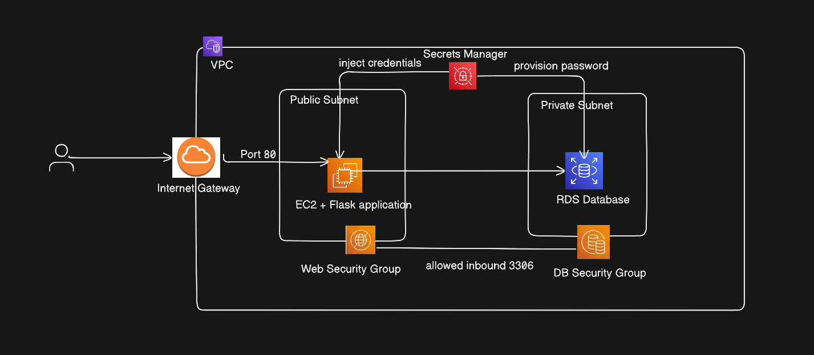
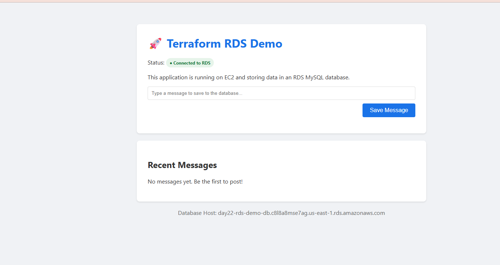
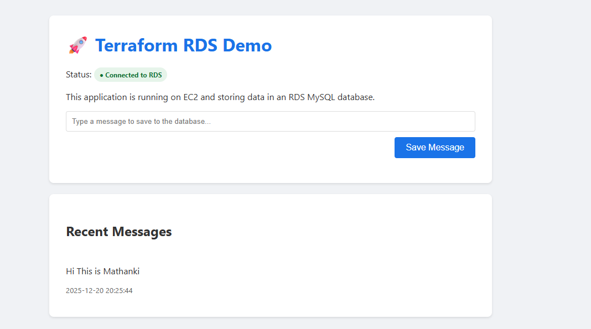

# Day 22 : Two -Tier Architecture Setup On AWS with Terraform | #30DaysOfAWSTerraform


As part of my **#30DaysOfAWSTerraform** journey, Day 22 focused on designing and deploying a **production-ready 2-tier architecture** on AWS using **Terraform modules**. This mini project demonstrates how a web application securely connects to a managed relational database while following cloud security and Infrastructure-as-Code best practices.

## Project Overview



This project provisions a **dynamic web application** hosted on **Amazon EC2** that securely connects to an **Amazon RDS** database. The entire infrastructure is built using **modular Terraform**, making the setup clean, reusable, and production-ready.

### Architecture at a Glance (2-Tier)

-   **Application Tier** – EC2 instance running the web application
    
-   **Database Tier** – Amazon RDS (MySQL)
    

## The Public Access Zone – The Web Tier

The **Public Access Zone** is the only part of the system exposed to users. There An **EC2 instance** running a **Flask web application**. This is where users interact with the system through their browser.

**Users Must Reach the Application Over the Internet:**

End users access the application using a browser from anywhere in the world.

To make this possible:

-   The EC2 instance is placed in a **public subnet**
    
-   The subnet has a route to an **Internet Gateway**
    
-   The instance is assigned a **public IP address**
    

Without these three elements, the application would be unreachable from outside AWS.

HTTP Traffic (Port 80) Is Explicitly Allowed:

**Web applications communicate using standard web protocols**:

-   **Port 80** → HTTP traffic

The Security Group attached to the EC2 instance:

-   Allows inbound traffic only on port 80
    
-   Rejects all other inbound requests by default
    

This ensures the server can **serve web pages**, but nothing else.

**Internet Gateway Enables Controlled External Access:**

An **Internet Gateway (IGW)** acts as a managed bridge between the VPC and the internet.

-   Allows inbound web requests to reach the EC2 instance
    
-   Allows outbound responses to be sent back to users
    
-   Provides **network address translation (NAT)** for public IPs
    

Without the Internet Gateway, traffic would stop at the VPC boundary.

### How the Public Web Tier Stays Protected

Even though the web tier is accessible, it is **hardened at multiple layers** to minimize risk.

1.  **Only Required Web Traffic Is Permitted:**

Security Groups act as **virtual firewalls**:

-   Inbound rules allow:
    
    -   HTTP (port 80) from anywhere
-   Outbound rules:
    
    -   Allow responses and database communication

Anything not explicitly allowed is **automatically denied**.

This “deny by default” behavior is a key AWS security principle.

2.  **All Unnecessary Ports Are Blocked:**
    
    No access is allowed to:
    
    -   Database ports
        
    -   Internal service ports
        
    -   Operating system ports (unless explicitly required)
        

This reduces:

-   Attack surface
    
-   Vulnerability exposure
    
-   Risk of brute-force or exploit attempts
    

An attacker reaching this server can only interact with the **web application**, nothing more.

3.  **No Sensitive Data Is Stored on the Server:**
    
    The EC2 instance is intentionally kept **stateless**:
    
    -   No database credentials stored in code
        
    -   No secrets saved in configuration files
        
    -   No sensitive data written to disk
        

Instead:

-   Credentials are fetched dynamically from **AWS Secrets Manager**
    
-   Secrets exist only in memory during runtime
    
-   The server can be terminated and recreated safely at any time
    

Even if the server is compromised, there are **no permanent secrets to steal**.

## The Restricted Core – The Data Tier (Where Trust Is Earned)

Behind the public-facing web layer lies the **Restricted Core**—the most sensitive part of the system. This tier is intentionally designed to be **invisible, unreachable, and untrusting** by default. At the heart of this layer is **Amazon RDS**, a fully managed relational database service that stores all application data—user records, application state, and transactional information.

RDS database:

-   Does not serve users directly
    
-   Does not accept arbitrary connections
    
-   Does not expose itself to the internet in any way
    

Its only responsibility is to **store data securely and respond to trusted requests**.

### Why the Data Tier Is Strictly Restricted

1.  **No Public IP Address:**
    
    The RDS instance is launched inside a **private subnet**, which means:
    
    -   AWS never assigns it a public IP
        
    -   It cannot send or receive traffic from the internet
        
    -   It exists only inside the VPC’s internal network
        

Without a public IP, the database is **unaddressable from the outside world**.

2.  **No Route to the Internet:**
    
    The private subnet’s route table:
    
    -   Does **not** point to an Internet Gateway
        
    -   Allows only internal VPC traffic
        

This ensures:

-   The database cannot accidentally expose itself
    
-   Even outbound internet access is blocked
    

From a networking perspective, the database is **sealed off**.

3.  **Invisible to External Attackers:**
    
    If an attacker:
    
    -   Scans IP ranges
        
    -   Probes open ports
        
    -   Attempts brute-force access
        

They will find **nothing**.

The database does not respond, does not advertise itself, and does not exist outside the VPC boundary.

### How Access Is Enforced

1.  **Only the Application Server Is Allowed:**
    
    Access to the database is restricted using **Security Groups**, which act as identity-aware firewalls.
    
    The RDS Security Group:
    
    -   Allows inbound traffic **only from the EC2 Security Group**
        
    -   Rejects all other sources automatically
        

This means:

-   Other EC2 instances cannot connect
    
-   Even resources in the same subnet are blocked unless explicitly allowed
    

2.  **Access Is Limited to a Single Port (3306):**
    
    The database listens only on its required port:
    
    -   **3306** for MySQL (or equivalent for other engines)

No other ports are open—no management ports, no debug access, no shortcuts.

Every request must:

-   Come from the correct source
    
-   Use the correct protocol
    
-   Follow the defined security rules
    

## Secure Credential Handling – Keys Without Exposure

Network security alone isn’t enough. The system must also protect **how credentials are created, stored, and used**. This is where **AWS Secrets Manager** becomes critical.

### The Secure Pattern Used in This Project

1.  **Secrets Are Generated, Not Written:**
    
    Instead of choosing a password manually:
    
    -   Terraform uses the `random_password` provider
        
    -   A strong, unpredictable password is generated automatically
        
    -   No human ever sees or handles the password
        

This removes human error entirely.

2.  **Secrets Are Stored in a Managed Vault:**
    
    The generated password is stored in **AWS Secrets Manager**, which:
    
    -   Encrypts secrets at rest
        
    -   Controls access using IAM
        
    -   Audits every secret request
        

Secrets Manager becomes the **single source of truth** for credentials.

3.  **The Application Requests the Secret at Runtime:**
    
    When the EC2 instance starts, the credential flow works as follows:
    
    1.  **The server boots up**
        
        -   The EC2 instance is launched in the public subnet
            
        -   Application dependencies are installed using `user_data`
            
    2.  **Credentials are injected during provisioning**
        
        -   Terraform generates a strong, random database password
            
        -   The password is stored in **AWS Secrets Manager**
            
        -   The same secret value is referenced during:
            
            -   RDS database creation
                
            -   Application configuration at launch time
                
    3.  **The application connects to the database**
        
        -   The database hostname, username, and password are passed to the application
            
        -   The application establishes a connection to Amazon RDS
            
        -   No credentials are typed manually or stored in source code
            

## Modular Terraform Design

The infrastructure is broken into **reusable Terraform modules**. This project is organized into five specialized modules, each responsible for a specific part of the cloud infrastructure. Below is a module-wise explanation.

```
    modules/
     ├── vpc/
     ├── ec2/
     ├── rds/
     ├── security_groups/
     ├── secrets/
```

Each module contains:

-   [`main.tf`](http://main.tf/)
    
-   [`variables.tf`](http://variables.tf/)
    
-   [`outputs.tf`](http://outputs.tf/)
    

### VPC Module (Networking)

This module builds the foundational network where all other resources reside.

-   **Virtual Private Cloud (VPC)**: Creates an isolated network with DNS hostnames and support enabled.
    
-   **Subnets**:
    
    -   **Public Subnet**: Used for the EC2 web server. It has `map_public_ip_on_launch` set to true to allow internet access.
        
    -   **Private Subnets**: Two subnets in different Availability Zones (AZs) specifically for the RDS database to ensure high availability.
        
-   **Internet Gateway (IGW)**: Allows communication between the VPC and the internet.
    
    ### Secrets Module (Security & Credentials)
    
    This module manages sensitive data, specifically the database credentials.
    
    -   **Random Password**: Generates a secure, 16-character password with special characters.
        
    -   **AWS Secrets Manager**:
        
        -   **Secret Metadata**: Creates a secret entry in AWS Secrets Manager with a unique name using a random suffix.
            
        -   **Secret Version**: Stores the actual username and generated password in a JSON format within the secret.
            
    -   **Outputs**: Exports the generated password and the Secret ARN to be used by the RDS and EC2 modules.
        

### Security Groups Module (Firewall Rules)

This module defines the traffic rules for the web and database layers.

-   **Web Security Group**:
    
    -   **Inbound**: Allows HTTP (Port 80) and SSH (Port 22) traffic from anywhere (`0.0.0.0/0`).
        
    -   **Outbound**: Allows all traffic to the internet.
        
-   **Database Security Group**:
    
    -   **Inbound**: Restricts access to MySQL (Port 3306) so that **only** the web server's security group can connect to it.

### RDS Module (Database)

This module provisions the managed MySQL database.

-   **DB Subnet Group**: Groups the private subnets from the VPC module to define where the RDS instance can be placed.
    
-   **RDS MySQL Instance**: Creates a MySQL 8.0 instance using the `db.t3.micro` class. It uses the credentials generated by the **Secrets Module** and is marked as `publicly_accessible = false` for security.
    

### EC2 Module (Application Server)

This module deploys the web server that hosts the Flask application.

-   **Latest Ubuntu AMI**: Automatically fetches the most recent Ubuntu 22.04 image.
    
-   **EC2 Instance**: Launches a `t2.micro` instance in the public subnet.
    
-   **User Data Script**: Executes a shell script (`user_`[`data.sh`](http://data.sh/)) on startup to:
    
    -   Install Python, Flask, and MySQL dependencies.
        
    -   Set up a virtual environment and a Flask app that connects to the RDS instance.
        
    -   Initialize the database table if it doesn't exist and provide a simple web interface.
        

### Root Module (Orchestration)

The **Root Module** ([`main.tf`](http://main.tf/) in the top directory) acts as the orchestrator. It calls each of the modules above and handles the flow of data between them—for example, passing the `vpc_id` from the VPC module to the Security Groups module.

## **Deployment Steps**

```
        terraform init
        terraform plan
        terraform apply
```

## **Verification & Testing**

Once `terraform apply` completes, look for the `application_url` in the outputs. Open the URL:



Type a message:



After save the message. The page will reload, with recnet messages list down those fetch from database.

## Conclusion

This mini project demonstrates how even a **simple 2-tier architecture** can be built in a **secure, scalable, and production-ready** way when Infrastructure as Code is used correctly.

By combining **modular Terraform**, **network isolation with public and private subnets**, **strict security group rules**, and **secure credential generation**, this project avoids many of the common mistakes seen in early cloud deployments—such as hardcoded secrets and publicly exposed databases.

The database remains completely hidden inside the private network, the application tier exposes only what is necessary, and every connection follows the principle of **least privilege**. Most importantly, the entire setup is **repeatable, auditable, and easy to evolve**, which is exactly what modern cloud infrastructure demands.

## Reference
https://www.youtube.com/watch?v=7XcqRDVMv3o&list=PLl4APkPHzsUXcfBSJDExYR-a4fQiZGmMp&index=24

