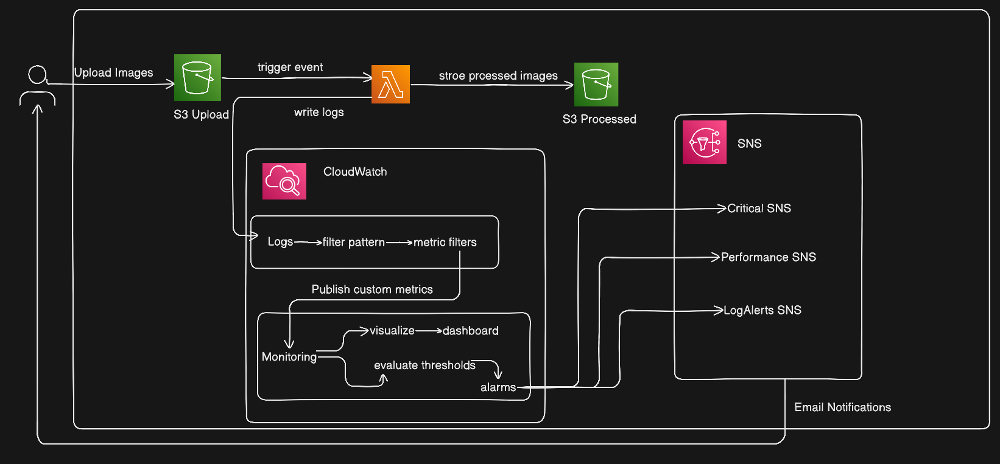

# Day 23 : Building a Secure, Observable AWS Serverless Image Processing System with Terraform | #30DaysOfAWSTerraform


Modern cloud systems don’t fail silently — **they must be observable, secure, and alert-driven**. In this project, I built a **production-style serverless image processing pipeline** on AWS using **Terraform**, with **comprehensive monitoring, security detection, and alerting**.

## Project Architecture



This architecture demonstrates a production-grade monitoring, alerting, and logging system built on AWS using Terraform. It is designed around a serverless image processing application to ensure high availability and proactive issue resolution.

### Core Application Workflow

**Trigger (S3 Upload):** The process begins when a user uploads an image to an **S3 Upload Bucket.**

**Processing (AWS Lambda):** The upload triggers an **AWS Lambda function**. This function processes the image into multiple formats (WebP, JPG, PNG, and thumbnails).

**Storage (S3 Processed):** The final processed images are stored in a separate **S3 Processed Bucket.**

### Observability Layer (CloudWatch)

The architecture uses **Amazon CloudWatch** as the central hub for observability.

**Logging:** Lambda automatically writes execution logs to CloudWatch Logs. The system uses **Metric Filters** to scan these logs for specific patterns, such as "Error" or "Processing Time," and converts them into custom metrics

**Monitoring & Dashboards:** A custom **CloudWatch Dashboard** visualizes the health of the system through various widgets, including total invocations, execution duration (P99 latency), error rates, and concurrent executions

**Alarms:** Based on predefined thresholds (e.g., more than 5 errors in a minute or high concurrency), **CloudWatch Alarms** are triggered to notify administrators

### Notification System (SNS)

When an alarm state is reached, the system uses **Amazon SNS (Simple Notification Service)** to route alerts to the appropriate stakeholders through three distinct channels.

-   **Critical SNS:** For high-priority system failures.
    
-   **Performance SNS:** For latency issues or threshold breaches.
    
-   **LogAlerts SNS:** For specific errors identified within the application logs.
    

These SNS topics then deliver real-time **Email Notifications** to ensure the DevOps team can respond immediately.

## Terraform Overview

This project uses a **modular Terraform architecture** to manage an end-to-end AWS observability stack. By breaking the infrastructure into six custom modules, the setup becomes reusable, maintainable, and production-grade.

Below is an overview of the modules used in the project:

### SNS Notification Module

This module sets up the alerting backbone using Amazon SNS. All alerts are routed through the SNS module. It creates three topics: **Critical**, **Performance**, and **Log Alerts**.

**Subscription Channels:**

-   **Email:** Standard for all alert types.
    
-   **SMS:** Reserved for **Critical** alerts only to ensure immediate response for system failures.
    

```
resource "aws_sns_topic" "critical_alerts" {
  name         = "${var.project_name}-${var.environment}-critical-alerts"
  display_name = "Critical Lambda Alerts - ${var.project_name}"

  tags = merge(
    var.tags,
    {
      Name      = "${var.project_name}-critical-alerts"
      AlertType = "Critical"
    }
  )
}

resource "aws_sns_topic_subscription" "critical_email" {
  count     = var.critical_alert_email != "" ? 1 : 0
  topic_arn = aws_sns_topic.critical_alerts.arn
  protocol  = "email"
  endpoint  = var.critical_alert_email
}
```

### S3 Buckets Module

Manages the storage layer, creating two buckets: one for initial image uploads and another for the processed output.

**Security Features:**

-   **Encryption:** All data is encrypted at rest using AES256.
    
-   **Public Access Block:** Strict blocks on all public ACLs and policies.
    
-   **Versioning:** Enabled by default to protect against accidental deletions.
    

```
resource "aws_s3_bucket" "upload_bucket" {
  bucket = "${var.project_name}-upload"
}

resource "aws_s3_bucket_server_side_encryption_configuration" "sec" {
  bucket = aws_s3_bucket.upload_bucket.id
  rule {
    apply_server_side_encryption_by_default {
      sse_algorithm = "AES256"
    }
  }
}
```

### Lambda Function Module

Deploys the image processing logic. It includes IAM roles and policies that allow the function to read from S3, write to S3, and publish logs/metrics to CloudWatch.

```
resource "aws_lambda_function" "function" {
  function_name = "image-processor"
  role          = aws_iam_role.lambda_role.arn
  handler       = "index.handler"
  runtime       = "python3.12"
  layers        = [var.pillow_layer_arn]
  #....other configurations
}
```

### CloudWatch Metrics Module

This module creates **Log Metric Filters**. It scans Lambda logs for specific patterns (like "Error" or "Processing Time") and converts them into custom metrics that can be graphed or used for alarms.

**Metric Filter: Lambda Errors**

```
pattern = "[timestamp, request_id, level = ERROR*, ...]"
```

It scans every line of logs. It specifically looks for the word `ERROR` in the "level" position of the log message. Every time it finds one, it adds **1** to a new metric called `LambdaErrors`. Standard Lambda metrics only count a "Failure" if the whole function crashes. This filter catches "soft errors"—cases where code handled an exception but still logged that something went wrong.

**Metric Filter: Image Processing Time**

```
pattern = "[..., processing_time_key = \"processing_time:\", processing_time, ...]"
```

This looks for a specific pattern in logs, like: `INFO: processing_time: 120`. It "grabs" the number following the colon (`120`) and records it as a **Millisecond** unit. It allows to track exactly how long specific parts of code take (like an API call or image compression) rather than just the total Lambda runtime.

**Metric Filter: Successful Processes**

```
pattern = "\"Successfully processed\""
```

A very simple text search. It looks for the exact phrase `"Successfully processed"`. Adds **1** to the `SuccessfulProcesses` count. This is a **Business Metric**. Even if there are zero errors, if this number is lower than usual, it means your system isn't getting work done (perhaps because an input queue is empty).

**Metric Filter: Image Size**

```
pattern = "[..., size_key = \"image_size:\", image_size, ...]"
```

Similar to the processing time filter, it looks for `image_size: 5000`. It extracts the number `5000` and saves it with the unit **Bytes.** his helps you understand your "payload profile." If your Lambda starts running slow, you can check this graph to see if users suddenly started uploading much larger files.

**Metric Filter: S3 Access Denied**

```
pattern = "AccessDenied"
```

t scans for the specific error string `AccessDenied`. Increments the `S3AccessDenied` counter. This is a **Security/Infrastructure** check. If this number is anything above zero, Lambda's IAM permissions are likely broken, and it can't reach its data source.

**The CloudWatch Dashboard**

This is the "Control Room" where all the data above is visualized. It uses `jsonencode` to build a layout of widgets.

#### The Layout Structure:

-   Top Row (Invocations & Duration): Shows the "health" of the infrastructure. Are people using the app? Is it fast? It includes **p99** (the speed experienced by the slowest 1% of users).
    
-   Middle Row (Concurrency & Success vs Errors): Monitors "throughput." It compares your custom success count against your custom error count. Ideally, the success line should be high and the error line at zero.
    
-   Bottom Row (Processing Time & Image Size): Monitors "efficiency." It correlates the size of the work (Image Size) with the time it takes to do it (Processing Time).
    
-   The Final Widget (Logs):
    
    ```
      query = "SOURCE ... | filter @message like /ERROR/ | limit 20"
    ```
    
    This is a **CloudWatch Logs Insights** widget. It doesn't show a graph; it shows the **actual text** of the last 20 errors. This allows a developer to see the error message and the timestamp without having to search through thousands of log lines manually.
    

### CloudWatch Alarms Module

The "watchdog" module. It creates alarms based on thresholds for both standard Lambda metrics and the custom metrics generated in CloudWatch Metrics Module. When a threshold is breached, it sends a notification to the SNS topics.

**Lambda Error Rate Alarm**

This is your primary "heartbeat" monitor. It tracks the standard `Errors` metric provided by lamda function.

```
resource "aws_cloudwatch_metric_alarm" "lambda_errors" {
  metric_name         = "Errors"
  statistic           = "Sum"
  threshold           = var.error_threshold
  alarm_actions       = [var.critical_alerts_topic_arn]
  # ...
}
```

It counts every time when code crashes or returns an unhandled exception. It uses `Sum`. If the total number of errors in a time window is higher than threshold, it triggers. It sends a notification to the **Critical Alerts** topic because a failing Lambda usually means a broken user experience.

**Lambda Duration (Timeout Warning)**

This monitors how long your function takes to run

```
resource "aws_cloudwatch_metric_alarm" "lambda_duration" {
  metric_name         = "Duration"
  statistic           = "Average"
  threshold           = var.duration_threshold_ms
  # ...
}
```

It tracks the execution time in milliseconds. If your Lambda is configured with a 30-second timeout, you might set this alarm to 25 seconds. If the `Average` duration hits that mark, you get a warning. t helps you catch "performance drift" (e.g., a database getting slower) before the Lambda actually starts timing out and failing.

**Lambda Throttles Alarm**

This monitors AWS service limits.

```
resource "aws_cloudwatch_metric_alarm" "lambda_throttles" {
  metric_name         = "Throttles"
  statistic           = "Sum"
  # ...
}
```

It triggers when AWS refuses to run function because it run out of "Concurrency" (too many functions running at the exact same time). Throttling is dangerous because the request is often dropped entirely. This alarm tells that need to increase **Reserved Concurrency** or request a limit increase from AWS.

**Concurrent Executions Alarm**

A proactive version of the Throttle alarm.

```
resource "aws_cloudwatch_metric_alarm" "concurrent_executions" {
  metric_name         = "ConcurrentExecutions"
  statistic           = "Maximum"
  threshold           = var.concurrent_executions_threshold
  # ...
}
```

It monitors the high-water mark of how many instances of your function are running simultaneously. f your limit is 1,000 and this hits 800, it triggers a **Warning**. This gives you time to react _before_ you actually get throttled.

**Custom Error Metric (Log-Based)**

This is a more advanced alarm that looks inside application logs.

```
resource "aws_cloudwatch_metric_alarm" "log_errors" {
  metric_name         = "LambdaErrors"
  namespace           = var.metric_namespace
  treat_missing_data  = "notBreaching"
  # ...
}
```

It assumes you have a "Metric Filter" (another AWS resource) scanning your logs for the word `ERROR`. Sometimes a Lambda "succeeds" (it doesn't crash), but your code writes an error message to the log because a specific task failed. This alarm catches those internal "soft" errors.

**No Invocations (The "Silence" Alarm)**

This alarm tells you if your function has stopped doing work entirely.

```
resource "aws_cloudwatch_metric_alarm" "no_invocations" {
  comparison_operator = "LessThanThreshold"
  threshold           = 1
  treat_missing_data  = "breaching"
  # ...
}
```

It checks if the number of times the Lambda was called is less than 1. `treat_missing_data = "breaching"`. Normally, if no one calls your Lambda, CloudWatch sees "no data" and does nothing. This setting tells CloudWatch: "If you see no data, assume it's broken and sound the alarm." If this Lambda is supposed to process files from S3 every few minutes and it stops, this alarm catches the broken connection.

**Low Success Rate (Business Metric)**

This monitors the "output" of work.

```
resource "aws_cloudwatch_metric_alarm" "low_success_rate" {
  metric_name         = "SuccessfulProcesses"
  comparison_operator = "LessThanThreshold"
  # ...
}
```

It monitors a custom metric you've created in your code (e.g., `images_processed_successfully`). If the number of successful items falls below your `min_success_threshold`, it alerts you. This is great for catching issues where the infrastructure is fine, but the data being processed is causing failures.

## **Deploy Project**

Now that everything is set up, the final step is to **deploy the entire infrastructure** using Terraform.

We execute the standard Terraform commands:

```
terraform init
terraform plan
terraform apply
```

### Verify

-   All resources are created successfully

## End-to-End Flow

1.  Image uploaded to S3
    
2.  Lambda triggered automatically
    
3.  Image processed and stored securely
    
4.  Logs and metrics generated
    
5.  CloudWatch evaluates metrics
    
6.  Alarms fire when thresholds are exceeded
    
7.  SNS sends real-time notifications
    

## Testing & Verification

### Test S3 → Lambda Trigger

Upload a Test Image

Verify:

-   Lambda function is triggered automatically
    
-   A processed file appears in the **processed bucket**
    

### Verify Lambda Logs

Go to **CloudWatch → Logs → Log Groups**

Verify

-   Invocation start and end logs
    
-   Processing time logs
    
-   Success messages
    
-   No unexpected errors
    

### Verify CloudWatch Metrics

Go to **CloudWatch → Metrics → Custom Namespaces**

### Verify Metrics Exist

-   `LambdaErrors`
    
-   `SuccessfulProcesses`
    
-   `ImageProcessingTime`
    
-   `ImageSizeBytes`
    
-   `S3AccessDenied`
    

### Verify CloudWatch Dashboard

Navigate to **CloudWatch → Dashboards**

### Verify

-   Lambda invocations increase
    
-   Duration and concurrency graphs update
    
-   Custom metrics display values
    
-   “Recent Errors” widget shows logs
    

### Test CloudWatch Alarms

Trigger an Error Alarm

-   Upload a **corrupt or unsupported file**
    
-   Or temporarily reduce Lambda memory/timeout
    

Verify

-   Error metric increments
    
-   Alarm state changes from **OK → ALARM**
    
-   SNS email notification is received
    

### Verify SNS Notifications

Email

-   Confirm SNS subscription email
    
-   Check inbox for:
    
    -   Alarm name
        
    -   Reason
        
    -   Timestamp
        

## Conclusion

This project demonstrates how to design and deploy a **production-ready, event-driven AWS architecture** with **security, observability, and operational excellence**. By combining Amazon S3, AWS Lambda, CloudWatch, and SNS using **modular Terraform**, we created a system that is not only functional but also **auditable, monitorable, and resilient**.

Through **end-to-end monitoring**, custom metrics, log-based alerts, and real-time notifications, the solution ensures that failures, performance issues, and security incidents are detected early and acted upon quickly. The use of **infrastructure as code** guarantees consistency, repeatability, and scalability across environments.

Most importantly, this project reflects real-world cloud engineering practices:

-   Secure-by-default S3 buckets
    
-   Event-driven processing with Lambda
    
-   Centralized logging and metrics
    
-   Proactive alerting and incident visibility
    
-   Modular, reusable Terraform design
    

Whether you’re building serverless pipelines, monitoring critical workloads, or preparing cloud infrastructure for production, this architecture serves as a **practical blueprint** for implementing **reliable, secure, and observable systems on AWS**.

## Reference

https://www.youtube.com/watch?v=IxMwlFJRWC0&list=PLl4APkPHzsUXcfBSJDExYR-a4fQiZGmMp&index=25