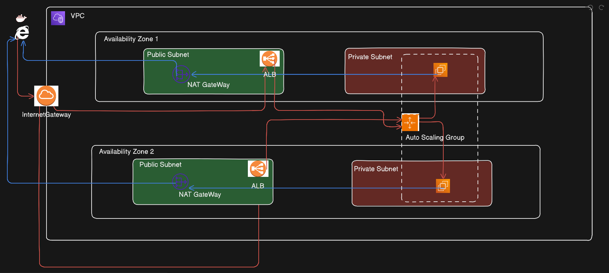
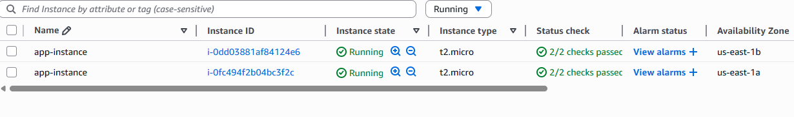
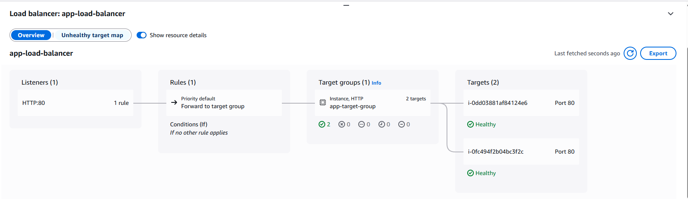
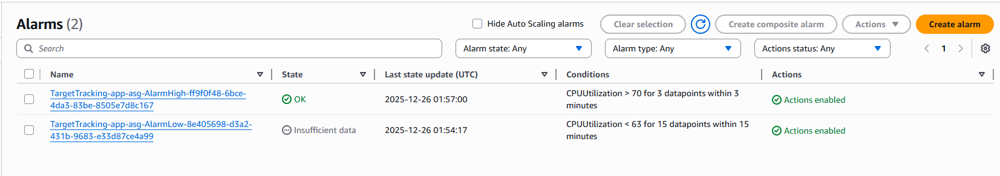
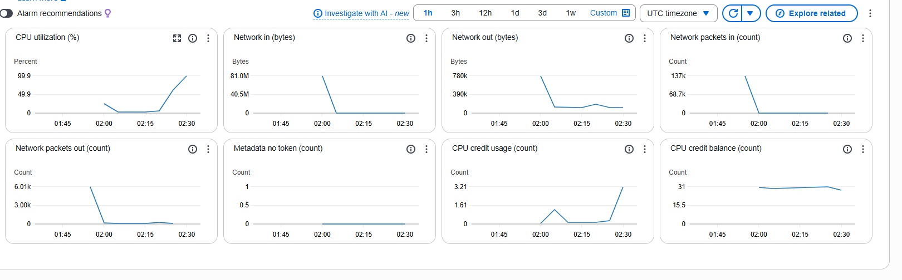
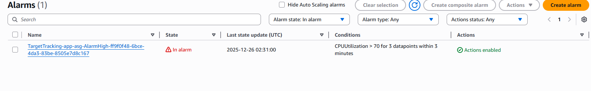
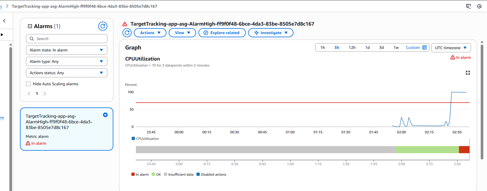
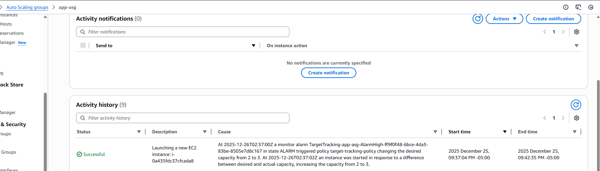

# Day 24:Building Highly Available & Scalable Infrastructure with Terraform | #30DaysOfAWSTerraform


In today’s cloud world, applications are expected to be **always available**, **fault-tolerant**, and **capable of scaling on demand**. Downtime and performance bottlenecks are no longer acceptable. This is where **Terraform**, combined with AWS best practices, becomes a powerful tool for building **highly available (HA)** and **scalable** infrastructure using Infrastructure as Code (IaC).

This blog walks through the **core concepts, architecture patterns, and Terraform design principles** needed to build production-ready systems.

## What Does High Availability and Scalability Mean?

### **High Availability (HA)**

High availability ensures that your application continues to function even when components fail.

Key goals:

-   Eliminate single points of failure
    
-   Automatically recover from instance or AZ failures
    
-   Maintain uptime and reliability
    

### **Scalability**

Scalability ensures your system can **handle changing workloads**.

Types of scalability:

-   **Horizontal scaling** – adding/removing instances
    
-   **Vertical scaling** – increasing instance size
    

In AWS, horizontal scaling is preferred and works perfectly with Terraform automation.

## Project **Architecture**



This architecture is designed to deliver **high availability, scalability, and security** for a containerized Django application using **AWS, Docker, Application Load Balancer, and Auto Scaling**, all deployed across **multiple Availability Zones**.

Let’s break it down layer by layer:

### Multi-Availability Zone Design (AZ1 & AZ2)

The infrastructure spans **two Availability Zones (AZ1 and AZ2)** within a single AWS region.

**Why this matters:**

-   Each AZ represents an **independent data center**
    
-   If one AZ experiences failure (power, network, or hardware issues), the application **continues serving traffic from the other AZ**
    
-   AWS services like ALB and Auto Scaling are **AZ-aware**, enabling seamless failover
    

### Outcome:

✔ No single point of failure

✔ Improved fault tolerance

✔ Higher SLA and reliability

### Application Load Balancer (ALB) – Traffic Entry Point

The **Application Load Balancer** acts as the **single public-facing endpoint** for all incoming traffic.

### Key responsibilities:

-   Accepts **HTTP/HTTPS requests** from users
    
-   Performs **health checks** on backend EC2 instances
    
-   Routes traffic only to **healthy containers**
    
-   Distributes requests evenly across AZs
    

Traffic flow:

User → ALB → Target Group → EC2 Instances

The ALB is deployed in **public subnets** across both AZs to ensure continuous accessibility.

### Public vs Private Subnets – Security by Design

### Public Subnets

Contain:

-   Application Load Balancer
    
-   NAT Gateways
    

Characteristics:

-   Have direct internet access via an Internet Gateway
    
-   Strictly limited to infrastructure that must be publicly reachable
    

### Private Subnets

Contain:

-   EC2 instances running the Django application inside Docker containers

Characteristics:

-   **No inbound internet access**
    
-   Only accept traffic from the ALB
    
-   Protected from direct attacks and exposure
    

### Security Benefit:

✔ Application servers are never exposed directly to the internet

✔ Attack surface is significantly reduced

### Dockerized Django Application

The Django application is fully containerized using **Docker**, ensuring consistency across environments.

### Why Docker?

-   Eliminates “it works on my machine” issues
    
-   Faster deployments and rollbacks
    
-   Consistent runtime across all EC2 instances
    

Port Mapping:

Inside the container:

-   Django runs on **port 8000** (default)

On the EC2 host:

-   Port **80** is exposed to receive HTTP traffic
    
-   Docker maps: Host Port 80 → Container Port 8000
    

This allows:

-   ALB to send standard HTTP traffic on port 80
    
-   Django to run without custom configuration changes
    

### DockerHub Integration

Each EC2 instance pulls the latest Django application image from **DockerHub**.

**How it works:**

1.  Auto Scaling launches a new EC2 instance
    
2.  User-data or startup script runs Docker
    
3.  Instance pulls the latest image from DockerHub
    
4.  Container starts automatically
    

**Benefit:**

✔ Zero-touch deployments

✔ Easy updates by pushing new images

✔ No manual server configuration

### Auto Scaling Group (ASG)

The **Auto Scaling Group** dynamically manages EC2 instances running the Django containers.

**Configuration:**

-   **Minimum:** 1 instance
    
-   **Desired:** 2 instances
    
-   **Maximum:** 5 instances
    

**What this achieves:**

-   Always keeps **at least one instance running**
    
-   Maintains **two instances under normal load**
    
-   Automatically scales up during traffic spikes
    
-   Scales down during low traffic to reduce cost
    

**Health Awareness:**

-   Unhealthy instances are automatically terminated
    
-   New instances are launched and registered with the ALB
    

### NAT Gateway – Secure Outbound Internet Access

Since EC2 instances live in **private subnets**, they cannot access the internet directly.

**Problem:**

The Django containers need outbound access to:

-   Pull Docker images from DockerHub
    
-   Install updates or dependencies
    

**Solution:**

**NAT Gateways** deployed in public subnets.

Traffic flow: Private EC2 → NAT Gateway → Internet → DockerHub

**Security Advantage:**

✔ No inbound internet access to EC2

✔ Outbound access only

✔ Strong isolation from external threats

## End-to-End Request Flow

Here’s the complete request lifecycle:

1.  User sends HTTP/HTTPS request
    
2.  Request reaches the ALB in a public subnet
    
3.  ALB forwards traffic to healthy EC2 instances
    
4.  EC2 instance routes traffic to Docker container
    
5.  Django app processes the request
    
6.  Response flows back through ALB to the user
    

Meanwhile:

-   ASG monitors load and scales automatically
    
-   NAT Gateway enables secure outbound communication
    

## How We Codify This Architecture with Terraform

Now that we understand the design, let’s look at how we turn these concepts into a repeatable "Infrastructure as Code" (IaC) reality using Terraform.

### Defining the Core Provider & Consistency

The foundation starts with the [`main.tf`](http://main.tf/) file. We ensure that our infrastructure is consistent by locking in the AWS provider version and setting global tags so we can track our project costs and environment.

```
# main.tf
terraform {
  required_providers {
    aws = {
      source  = "hashicorp/aws"
      version = "~> 5.0" # Ensures we use the latest 5.x features
    }
  }
}

provider "aws" {
  region = var.region
  default_tags {
    tags = {
      Environment = var.environment
      Project     = "AWS-Production-Infrastructure"
      ManagedBy   = "Terraform"
    }
  }
}
```

### Deploying the Traffic Entry Point (ALB)

In [`alb.tf`](http://alb.tf/), we provision the **Application Load Balancer**. Note that it is set to `internal = false`, making it the public-facing gateway we discussed. We also define a **Target Group** with health checks to ensure the ALB only talks to healthy Django containers.

```
# alb.tf
resource "aws_lb" "app_lb" {
  name               = "app-load-balancer"
  load_balancer_type = "application"
  internal           = false # Public-facing
  subnets            = aws_subnet.public[*].id
  security_groups    = [aws_security_group.alb_sg.id]
}
```

### Orchestrating the Auto Scaling Group (ASG)

The "Scaling" magic happens in [`asg.tf`](http://asg.tf/). This file defines the **Launch Template**—which includes the user-data script to pull your Docker images—and the **Auto Scaling Group** that manages your fleet across private subnets.

To make this truly scalable, we use a **Target Tracking Policy**. This tells AWS: _"Keep my average CPU utilization at 70%. If it goes higher, add more servers automatically"_.

```
# asg.tf
resource "aws_autoscaling_group" "app_asg" {
  min_size         = var.min_size
  max_size         = var.max_size
  desired_capacity = var.desired_capacity
  vpc_zone_identifier = aws_subnet.private[*].id
  target_group_arns   = [aws_lb_target_group.app_tg.arn]

  launch_template {
    id      = aws_launch_template.app.id
    version = "$Latest"
  }
}

# The "Brain" of Scaling: Target Tracking at 70% CPU
resource "aws_autoscaling_policy" "target_tracking" {
  name                   = "target-tracking-policy"
  autoscaling_group_name = aws_autoscaling_group.app_asg.name
  policy_type            = "TargetTrackingScaling"

  target_tracking_configuration {
    predefined_metric_specification {
      predefined_metric_type = "ASGAverageCPUUtilization"
    }
    target_value = 70.0 # Our threshold for high availability
  }
}
```

### Security by Design (Security Groups)

In `security_`[`groups.tf`](http://groups.tf/), we enforce the "Security by Design" layer. We create a strict rule where the EC2 instances **only** accept traffic if it comes directly from our ALB’s security group. This prevents anyone from bypassing the load balancer to access your servers.

```
# security_groups.tf
resource "aws_security_group" "app_sg" {
  name        = "app-security-group"
  vpc_id      = aws_vpc.main.id

  ingress {
    description     = "HTTP from ALB only"
    from_port       = 80
    to_port         = 80
    protocol        = "tcp"
    security_groups = [aws_security_group.alb_sg.id] # Only the ALB is allowed
  }
}
```

### Enabling Remote Management (SSM)

Instead of using insecure SSH keys, this architecture uses **AWS Systems Manager (SSM)**. We attach an IAM role to our instances that includes the `AmazonSSMManagedInstanceCore` policy. This allows you to log into your private instances securely through the AWS Console without ever opening Port 22.

## **Deploy Project**

Now that everything is set up, the final step is to **deploy the entire infrastructure** using Terraform.

We execute the standard Terraform commands:

```
terraform init
terraform plan
terraform apply
```

## Testing & Validation

Once Terraform finishes, it often provides an **output** (like a Load Balancer DNS name). This is your entry point.


check if AWS servers are "Healthy.





Cloud watch Alerm created



To verify that your **Auto Scaling Group (ASG)** is working as intended, need to perform a **Stress Test**. This manually pushes your existing instances to their limit, forcing AWS to realize the load is too high and trigger the "Scale Out" policy to launch more servers.


After make server is "stressed"



Check the cloudWatch alarm







This confirms that the CloudWatch alarm successfully "told" the ASG to scale

## Conclusion

This project demonstrates how **Terraform enables the creation of highly available, scalable, and secure cloud infrastructure** using clear, repeatable Infrastructure as Code practices. By distributing resources across multiple Availability Zones, placing application servers in private subnets, and fronting them with an Application Load Balancer, the architecture eliminates single points of failure while maintaining strong security boundaries.

The use of **Auto Scaling Groups** ensures the system automatically adapts to changing traffic demands, delivering consistent performance during peak loads while optimizing costs during quieter periods. Containerizing the Django application with **Docker** further simplifies deployments, guarantees environment consistency, and allows new instances to become production-ready within minutes.

Finally, by leveraging **NAT Gateways for secure outbound access** and managing all configurations through Terraform, this architecture achieves a balance of **resilience, automation, and operational efficiency**. It serves as a strong, production-grade foundation that can be easily extended with CI/CD pipelines, HTTPS, monitoring, and managed databases—proving the power of Terraform in building modern cloud-native systems.

## Reference
https://www.youtube.com/watch?v=XAPCxphpgmQ&list=PLl4APkPHzsUXcfBSJDExYR-a4fQiZGmMp&index=30
