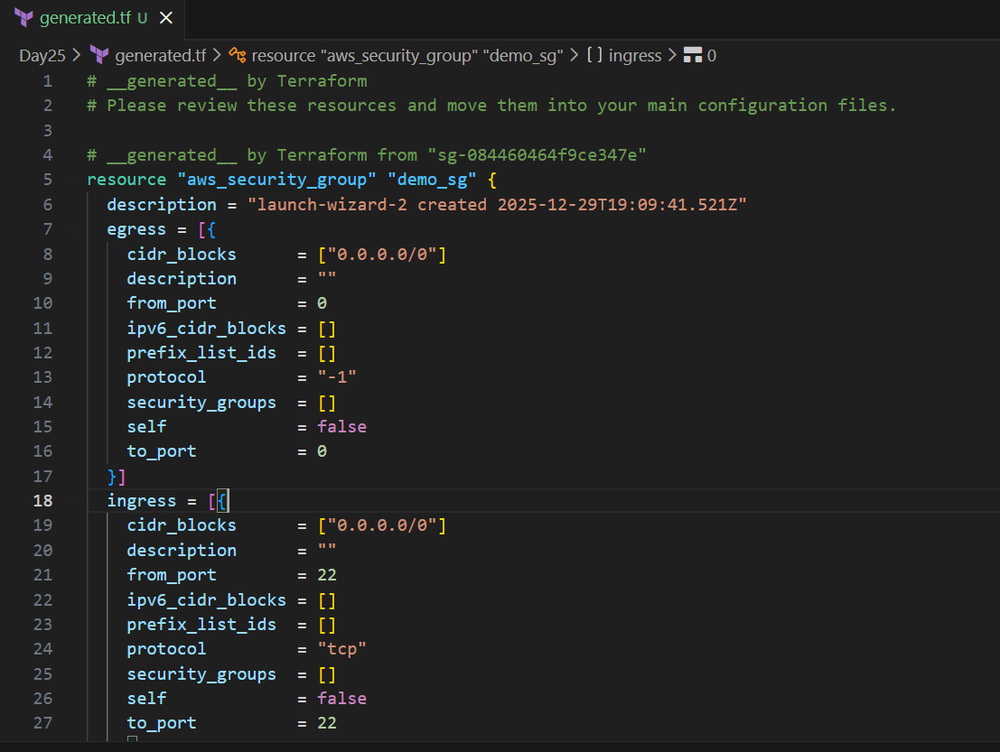
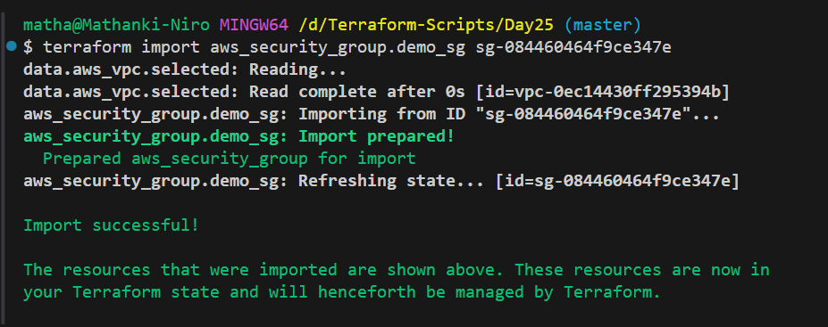
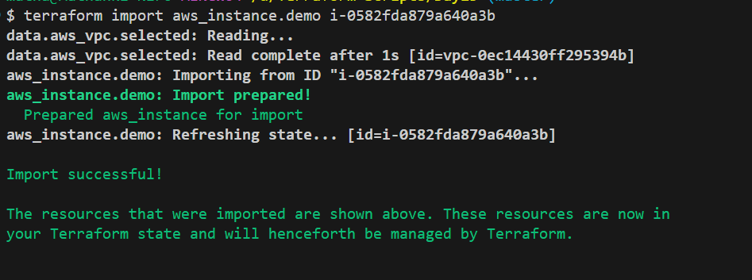
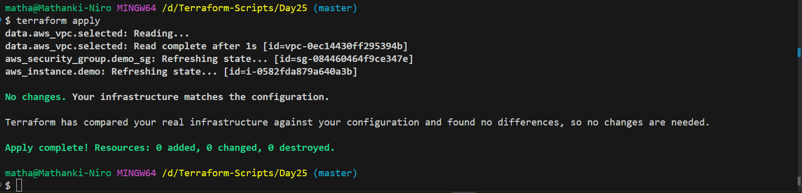
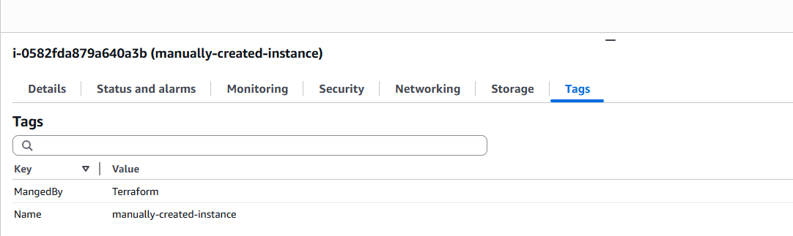

-

# Day 25 : Migrating Existing AWS Infrastructure to Terraform | #30DaysOfAWSTerraform


In the early stages of a cloud journey, many teams create resources manually via the AWS Console or through various standalone scripts. However, as your environment grows, manual management becomes a liability. You lose track of changes, security groups drift, and "unplanned" updates lead to downtime.

The solution is migrating to **Terraform.** But how do you do it? In this post, we look at the **Traditional Way** versus the **Modern Way**, and why you should never go back to the old method. The solution is migrating to **Terraform.**

Earlier Terraform versions _allowed_ imports—but the process was manual, risky, and time-consuming.

Terraform **1.5 changed the game** by introducing **import blocks** and **automatic configuration generation**.

In this blog, we’ll compare:

-   ❌ The **old, traditional migration approach**
    
-   ✅ The **new, modern Terraform 1.5+ workflow**
    

## Why Migrate Existing Infrastructure to Terraform?

Most teams already run production workloads on AWS: EC2, VPCs, ALBs , RDS databases, Security Groups and IAM roles.

Terraform migration helps:

-   Eliminate manual configuration drift
    
-   Introduce version control for infrastructure
    
-   Enable safe automation and CI/CD
    
-   Improve auditability and governance
    

## The Old Approach (Before Terraform 1.5)

Before 2023, importing was a manual, error-prone process. It required a "trial and error" approach that frustrated many engineers.

### How It Worked

The traditional migration process looked like this:

1.  Manually inspect AWS resources
    
2.  Write Terraform resource blocks by hand
    
3.  Run `terraform import`
    
4.  Run `terraform plan`
    
5.  Fix mismatches
    
6.  Repeat until plan is clean
    

Terraform often showed:

-   Missing attributes
    
-   Incorrect defaults
    
-   Unexpected changes
    

You had to:

-   Compare AWS Console vs Terraform
    
-   Add or remove arguments
    
-   Re-run plan repeatedly
    

### Problems with the Old Approach

-   Manual and error-prone
    
-   Required deep AWS + Terraform knowledge
    
-   High risk of accidental changes
    
-   Difficult for large infrastructures
    
-   Not beginner-friendly
    

## The New Approach (Terraform 1.5+)

With the release of Terraform 1.5, HashiCorp introduced **Config-Driven Import**. Now, Terraform writes the code for you.

### New Migration Strategy

**Declare → Generate → Review → Apply**

No manual guessing. No trial and error.

### Step 1: The Import Block

Instead of a CLI command, declare intent directly in the code using an `import` block.

```
# Import the Instance
import {
  to = aws_instance.demo
  id = "i-0582fda879a640a3b" # Replace with your actual Instance ID
}

# Import the Security Group
import {
  to = aws_security_group.demo_sg
  id = "sg-084460464f9ce347e" 
}
```

### Step 2: Automatic Code Generation

This is the magic step. You run a special plan command that tells Terraform to inspect the AWS resource and **write the HCL code for you**.

```
terraform plan -generate-config-out=generated.tf
```



### Step 3: Review and Merge

Terraform creates [`generated.tf`](http://generated.tf/). You simply:

1.  Copy the generated resource block into your [`main.tf`](http://main.tf/).
    
2.  Remove the `import` block.
    
3.  Run `terraform import` once to finalize the state sync.
    

```
terraform import aws_security_group.demo_sg sg-084460464f9ce347e
```



```
terraform import aws_instance.demo i-0582fda879a640a3b
```



Before applying:

-   Remove computed-only fields
    
-   Replace hardcoded values with variables
    
-   Standardize tags
    
-   Improve naming
    

This is **review-first IaC**, not blind automation.

### Step 4: Apply Safely

```
terraform apply
```



Terraform:

-   Imports the resource into state
    
    **The Mapping:** Terraform creates a link between your logical name in the code and the physical ID in AWS.
    
-   Makes **no infrastructure changes**
    
    One of the biggest fears when migrating to Terraform is that the tool will try to "re-create" the resource, causing downtime.
    
    -   **The "No-Op" Plan:** If your generated code matches the live resource exactly, `terraform apply` will report **"0 added, 0 changed, 0 destroyed."**
        
    -   **Safety Buffer:** Because the state now matches the real world, Terraform recognizes that the work is already done. It "claims ownership" without actually touching the running server or database.
        
-   Starts managing the resource going forward
    
    This is the most important transition. From this moment on, the AWS Console should be considered "Read Only" for this resource.
    
    -   **Code is Law:** If you want to change the instance type from `t2.micro` to `t3.medium`, you change it in your `.tf` file and run `apply`.
        
    -   **Drift Protection:** If a "Console Cowboy" manually changes a setting in the AWS portal, the next time you run `terraform plan`, Terraform will detect that the real world no longer matches your code and will offer to fix it.
        
    -   **Lifecycle Control:** You can now use Terraform features like `prevent_destroy = true` to protect your newly imported production resources from accidental deletion.
        

## **Testing**

After terrafrom get control the resourses try to make changes and check in aws console:

Add new Tag in aws inctance

```
resource "aws_instance" "demo" {
  ami                                  = "ami-0ecb62995f68bb549"
  instance_type                        = "t3.micro"
  region                               = "us-east-1"
  security_groups                      = [aws_security_group.demo_sg.name]
  tags = {
    Name = "manually-created-instance"
    MangedBy="Terraform"
  }
  vpc_security_group_ids      = [aws_security_group.demo_sg.id]

}
```

Updated the value in aws console:



## Conclusion

Migrating existing AWS infrastructure to Terraform no longer has to be a risky or painful process. The traditional approach—manually writing resource definitions, importing them one by one, and repeatedly fixing drift—worked, but it required deep expertise and carried a high risk of errors.

With **Terraform 1.5**, the introduction of **import blocks** and **automatic configuration generation** fundamentally changes this experience. Teams can now adopt Infrastructure as Code using a **plan-first, review-driven workflow** that is safer, faster, and far more approachable. Instead of guessing resource attributes, Terraform reads the live infrastructure and generates accurate, production-ready configuration that can be reviewed and refined before any changes are applied.

The real value of this new approach is confidence. You gain full visibility into your infrastructure, reduce configuration drift, and establish Terraform as a single source of truth—without downtime or disruption. Whether you are modernizing legacy environments or standardizing cloud operations, Terraform 1.5 makes infrastructure migration a practical and scalable reality.

In short, migrating to Terraform is no longer just about managing resources—it’s about building **reliable, auditable, and future-ready cloud infrastructure**.

## Reference
https://www.youtube.com/watch?v=gnO0P9CgVoo&list=PLl4APkPHzsUXcfBSJDExYR-a4fQiZGmMp&index=27