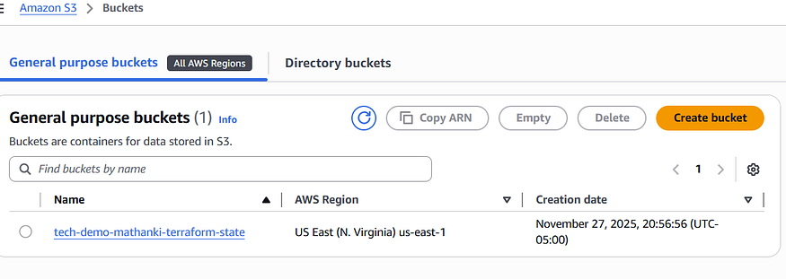
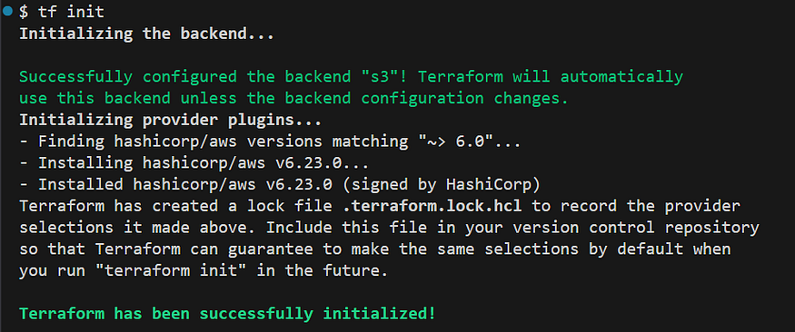
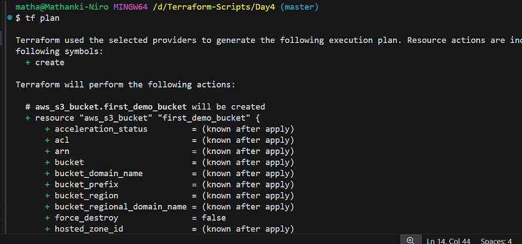
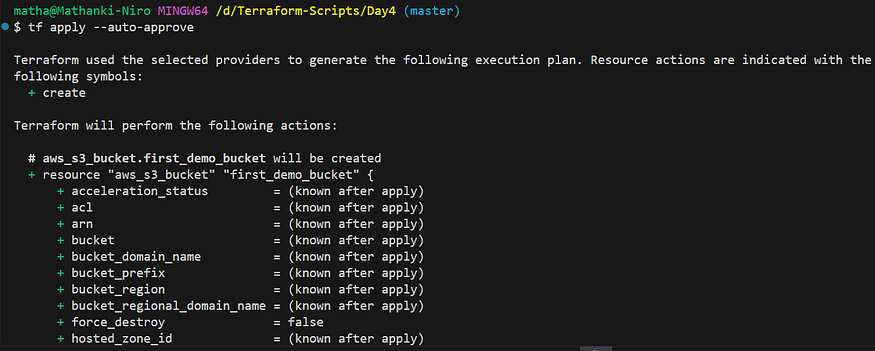
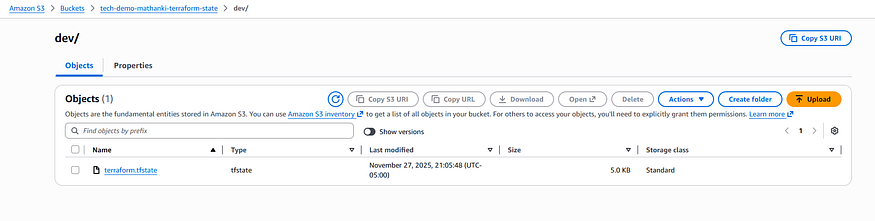
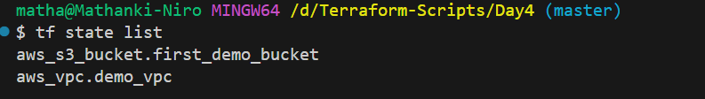
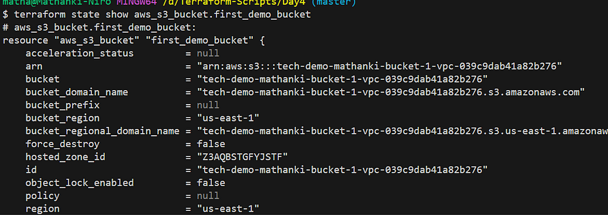

# Day 4: Terraform State file management with AWS S3 — #30DaysOfAWSTerraform

Day 3 written my first `resource` block, launched a VPC, S3 Bucket. I have mastered the basics of **Infrastructure as Code (IaC)**.

But as soon as understand a new, complex challenge emerges: **Terraform State Management.**

If still relying on a local `terraform.tfstate` file, it exposing the project to risks that include **state corruption**, **resource duplication**, and **security vulnerabilities**.

Today’s session took me deeper into this critical area. This guide breaks down everything need to know to move from risky local state to a secure, scalable, and collaborative remote solution.

### How Terraform Manages Infrastructure

Terraform works by constantly striving to make the **Actual State** (what exists in AWS, Azure, etc.) match the **Desired State** (what you wrote in your `.tf` files).

The `**terraform.tfstate**` file is the critical piece that connects these two worlds. It is a JSON map that records:

-   **The resources Terraform created.**
-   **The attributes and IDs** of those resources (like the specific VPC ID, or an S3 bucket name).

When you run `terraform plan`, Terraform uses the state file to check the actual infrastructure and determine _what_ needs to be added, modified, or destroyed.

The State File is the Source of Truth:

Press enter or click to view image in full size


**If you lose the state file**, Terraform forgets what it built, and you risk creating duplicate resources or being unable to manage existing ones. This is why keeping it safe is the _highest priority_.

### State File Best Practices: The S3 Remote Backend

As discussed, storing the state locally is dangerous. We will use an **S3 Remote Backend** for safety, which requires three key features for a robust, team-friendly setup:

1.  **Version Control (Versioning):** Allows restoration from corruption or accidental deletion.
2.  **Encryption (SSE-S3):** Protects sensitive data contained within the state file while at rest.
3.  **State Locking (S3 Native):** Prevents team members from simultaneously running `terraform apply` and corrupting the state file.

The theory is sound, but how do we actually move from a risky local state to a secure, collaborative, and durable remote backend?

The three upcoming steps form a cohesive workflow that transforms your project from using the default local state to leveraging enterprise-grade state management in S3.

### 1\. Provisioning a Secure Backend Bucket

The bucket that holds state file must have specific security features enabled. This can be done via the AWS Console, a separate, minimal Terraform configuration, or an AWS CLI script.

Here is a formal, step-by-step guide on how to create the S3 bucket with the required best practices:

-   Versioning enabled — This feature is a crucial **safety net** for your state file (`terraform.tfstate`). If a Terraform run fails, a state file becomes corrupted, or a file is accidentally deleted, you can easily **roll back** to a previous, known-good version of the state file and recover your infrastructure.
-   Configure Default Encryption — Terraform state files often contain **sensitive data** (like API keys, passwords, and private network information). Encryption ensures this data is protected while it is stored on the S3 disk.
-   Block Public Access — The state file must **never be publicly accessible** due to the sensitive nature of the data it holds. Enabling Block Public Access is the **most crucial security measure** to guarantee the confidentiality and integrity of your Terraform state.

Press enter or click to view image in full size



### 2\. Configuring the Backend for S3 Native Locking

Once secure S3 bucket is provisioned, configure project’s main Terraform files to use it. This utilizes S3’s conditional write capabilities for locking, **without needing a separate DynamoDB table.**

Here is the complete code:

```
terraform {
  required_providers {
    aws = {
      source  = "hashicorp/aws"
      version = "~> 6.0"
    }
  }
  backend "s3" {
    bucket         = "tech-demo-mathanki-terraform-state" 
    key            = "dev/terraform.tfstate" 
    region         = "us-east-1"
    encrypt        = true
    use_lockfile   = true 
    
  }
}


provider "aws" {
  region = "us-east-1"
}


resource "aws_vpc" "demo_vpc"{
  cidr_block       = "10.0.0.0/16"
  instance_tenancy = "default"

  tags = {
    Name = "My_demo_vpc"
  }
}


resource "aws_s3_bucket" "first_demo_bucket"{
  bucket = "tech-demo-mathanki-bucket-1-${aws_vpc.demo_vpc.id}"

  tags = {
    Name        = "My bucket 1.0"
    Environment = "Dev"
  }
}

```

After add the `backend` block, must run the following command to initialize the connection and migrate any existing local state:

1.  terraform init

Press enter or click to view image in full size



2\. terraform plan

Press enter or click to view image in full size



3\. terraform apply — auto-approve

Press enter or click to view image in full size



Press enter or click to view image in full size



Pratice State Commands:

1.  terraform state list — List resources in state

Press enter or click to view image in full size



2\. terraform state show aws\_s3\_bucket.first\_demo\_bucket — Show detailed state information

Press enter or click to view image in full size



### Conclusion

Today’s exercise underscored a fundamental truth of Infrastructure as Code: the code itself is only half the story. The real-world utility and reliability of Terraform hinge entirely on **proper state management**.

### Reference

[Terraform State file management with AWS S3](https://www.youtube.com/watch?v=YsEdrl9O5os&list=PLl4APkPHzsUXcfBSJDExYR-a4fQiZGmMp&index=5)
